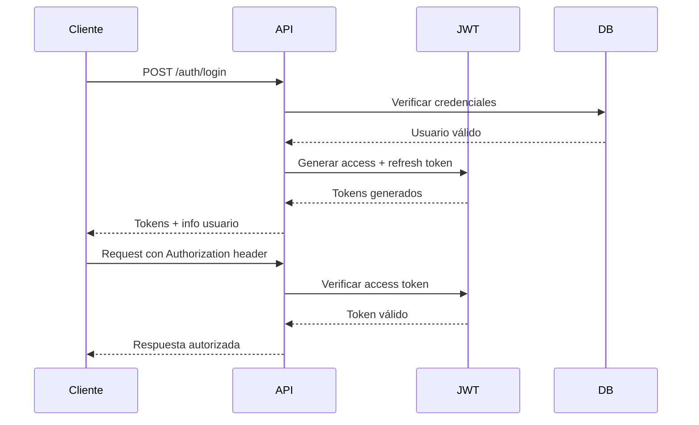

# 🔐 SISTEMA DE AUTENTICACIÓN - DOCUMENTACIÓN COMPLETA

## 📋 Tabla de Contenidos

1. [Descripción General](#descripción-general)
2. [Arquitectura del Sistema](#arquitectura-del-sistema)
3. [Endpoints de Autenticación](#endpoints-de-autenticación)
4. [Tokens JWT](#tokens-jwt)
5. [Middleware de Autorización](#middleware-de-autorización)
6. [Ejemplos de Uso](#ejemplos-de-uso)
7. [Seguridad y Mejores Prácticas](#seguridad-y-mejores-prácticas)
8. [Casos de Prueba](#casos-de-prueba)

---

## 🎯 Descripción General

El **Sistema de Autenticación** de SIGED implementa un mecanismo robusto y seguro basado en **JWT (JSON Web Tokens)** con tokens de acceso y refresh tokens, proporcionando control granular de acceso y gestión de sesiones.

### 🔑 **Funcionalidades Principales**

- ✅ **Autenticación JWT**: Login seguro con tokens de acceso y refresh
- ✅ **Autorización por Roles**: Control granular con 3 niveles de permisos
- ✅ **Gestión de Sesiones**: Logout y invalidación de tokens
- ✅ **Refresh Tokens**: Renovación automática de sesiones
- ✅ **Middleware de Seguridad**: Protección de rutas por rol
- ✅ **Token Blacklist**: Control de tokens revocados

---

## 🏗️ Arquitectura del Sistema

```
auth/
├── 📁 auth.controller.ts          # Controlador de autenticación
├── 📁 auth.routes.ts              # Rutas de auth
└── 📁 [relacionados]
    ├── auth.middleware.ts         # Middleware de autorización
    ├── jwt.service.ts             # Servicio JWT
    └── token-blacklist.service.ts # Gestión de tokens revocados
```

### 🌐 **Flujo de Autenticación**



---

## 🛣️ Endpoints de Autenticación

### **🔓 Iniciar Sesión**
```http
POST /api/auth/login
```
**Acceso**: Público

**Body**:
```json
{
  "documento": "12345678",
  "contrasena": "MiContrasena123"
}
```

**Respuesta Exitosa**:
```json
{
  "success": true,
  "message": "Autenticación exitosa",
  "data": {
    "usuario": {
      "id": "uuid-usuario",
      "nombre": "Juan Carlos",
      "apellido": "Pérez García", 
      "email": "juan.perez@example.com",
      "documento": "12345678",
      "rol": "admin",
      "estado": "activo"
    },
    "accessToken": "eyJhbGciOiJIUzI1NiIsInR5cCI6IkpXVCJ9...",
    "refreshToken": "eyJhbGciOiJIUzI1NiIsInR5cCI6IkpXVCJ9...",
    "expiresIn": "2h"
  }
}
```

**Respuesta de Error**:
```json
{
  "success": false,
  "message": "Credenciales inválidas",
  "error": "Invalid Credentials"
}
```

### **🔄 Renovar Token**
```http
POST /api/auth/refresh
```
**Acceso**: Público (requiere refresh token válido)

**Headers**:
```
Authorization: Bearer {refreshToken}
```

**Respuesta**:
```json
{
  "success": true,
  "message": "Token renovado exitosamente",
  "data": {
    "accessToken": "eyJhbGciOiJIUzI1NiIsInR5cCI6IkpXVCJ9...",
    "expiresIn": "2h"
  }
}
```

### **👤 Obtener Información del Usuario**
```http
GET /api/auth/me
```
**Acceso**: Privado (requiere access token)

**Headers**:
```
Authorization: Bearer {accessToken}
```

**Respuesta**:
```json
{
  "success": true,
  "data": {
    "id": "uuid-usuario",
    "nombre": "Juan Carlos",
    "apellido": "Pérez García",
    "email": "juan.perez@example.com", 
    "documento": "12345678",
    "rol": "admin",
    "estado": "activo",
    "ultimoAcceso": "2025-10-07T12:00:00.000Z"
  }
}
```

### **🚪 Cerrar Sesión**
```http
POST /api/auth/logout
```
**Acceso**: Privado (requiere access token)

**Headers**:
```
Authorization: Bearer {accessToken}
```

**Respuesta**:
```json
{
  "success": true,
  "message": "Sesión cerrada exitosamente"
}
```

### **🔐 Cambiar Contraseña (Autenticado)**
```http
POST /api/auth/change-password
```
**Acceso**: Privado (requiere access token)

**Body**:
```json
{
  "contrasenaActual": "MiContrasenaActual123",
  "nuevaContrasena": "MiNuevaContrasena456"
}
```

**Respuesta**:
```json
{
  "success": true,
  "message": "Contraseña cambiada exitosamente"
}
```

---

## 🎫 Tokens JWT

### **Estructura del Access Token**

```json
{
  "header": {
    "alg": "HS256",
    "typ": "JWT"
  },
  "payload": {
    "id": "uuid-usuario",
    "documento": "12345678",
    "email": "juan.perez@example.com",
    "rol": "admin",
    "estado": "activo",
    "iat": 1696680000,
    "exp": 1696687200
  },
  "signature": "..."
}
```

### **Estructura del Refresh Token**

```json
{
  "payload": {
    "id": "uuid-usuario",
    "tipo": "refresh",
    "iat": 1696680000,
    "exp": 1699272000
  }
}
```

### **Configuración de Tokens**

| Token Type | Duración | Uso |
|------------|----------|-----|
| **Access Token** | 2 horas | Autenticación de requests |
| **Refresh Token** | 30 días | Renovación de access tokens |

---

## 🛡️ Middleware de Autorización

### **authMiddleware**
Verifica la validez del access token y extrae información del usuario.

```typescript
// Uso básico
router.use(authMiddleware);

// El middleware agrega req.usuario con:
interface UsuarioAutenticado {
  id: string;
  documento: string;
  email: string;
  rol: 'super_admin' | 'admin' | 'gestor';
  estado: 'activo' | 'inactivo' | 'suspendido';
}
```

### **roleMiddleware**
Controla acceso por roles específicos.

```typescript
// Solo super_admin y admin
router.use(roleMiddleware(['super_admin', 'admin']));

// Solo super_admin
router.use(roleMiddleware(['super_admin']));

// Todos los roles (equivalente a solo authMiddleware)
router.use(roleMiddleware(['super_admin', 'admin', 'gestor']));
```

### **canModifyUserMiddleware**
Controla quién puede modificar usuarios específicos.

```typescript
// Permite:
// - super_admin: puede modificar cualquier usuario
// - admin: puede modificar admin y gestor (no super_admin)
// - gestor: solo puede modificar su propio usuario
router.use(canModifyUserMiddleware);
```

### **Ejemplo de Uso en Rutas**

```typescript
// Ruta pública
router.post('/login', AuthController.login);

// Ruta privada básica
router.get('/me', 
  authMiddleware, 
  AuthController.me
);

// Ruta con control de roles
router.post('/usuario', 
  authMiddleware,
  roleMiddleware(['super_admin', 'admin']),
  UsuarioController.createUsuario
);

// Ruta con control jerárquico
router.put('/usuario/:id',
  authMiddleware,
  canModifyUserMiddleware,
  UsuarioController.updateUsuario
);
```

---

## 🧪 Ejemplos de Uso Completos

### **Flujo 1: Autenticación Completa**

```bash
# 1. Login inicial
curl -X POST http://localhost:3000/api/auth/login \
  -H "Content-Type: application/json" \
  -d '{
    "documento": "12345678",
    "contrasena": "MiContrasena123"
  }'

# Guardar tokens de la respuesta
ACCESS_TOKEN="eyJhbGciOiJIUzI1NiIsInR5cCI6IkpXVCJ9..."
REFRESH_TOKEN="eyJhbGciOiJIUzI1NiIsInR5cCI6IkpXVCJ9..."

# 2. Usar access token para requests autenticados
curl -X GET http://localhost:3000/api/auth/me \
  -H "Authorization: Bearer $ACCESS_TOKEN"

# 3. Renovar token cuando expire
curl -X POST http://localhost:3000/api/auth/refresh \
  -H "Authorization: Bearer $REFRESH_TOKEN"

# 4. Logout
curl -X POST http://localhost:3000/api/auth/logout \
  -H "Authorization: Bearer $ACCESS_TOKEN"
```

### **Flujo 2: Manejo de Expiración**

```bash
# Request con token expirado
curl -X GET http://localhost:3000/api/usuario \
  -H "Authorization: Bearer $EXPIRED_TOKEN"

# Respuesta: 401 Unauthorized
{
  "success": false,
  "message": "Token expirado",
  "error": "Token Expired"
}

# Renovar con refresh token
curl -X POST http://localhost:3000/api/auth/refresh \
  -H "Authorization: Bearer $REFRESH_TOKEN"

# Usar nuevo access token
NEW_ACCESS_TOKEN="..."
curl -X GET http://localhost:3000/api/usuario \
  -H "Authorization: Bearer $NEW_ACCESS_TOKEN"
```

### **Flujo 3: Control de Roles**

```bash
# Gestor intentando crear usuario (sin permisos)
curl -X POST http://localhost:3000/api/usuario \
  -H "Authorization: Bearer $GESTOR_TOKEN" \
  -H "Content-Type: application/json" \
  -d '{"nombre": "Test"}'

# Respuesta: 403 Forbidden
{
  "success": false,
  "message": "No tienes permisos para realizar esta acción",
  "error": "Insufficient Permissions"
}

# Admin creando usuario (con permisos)
curl -X POST http://localhost:3000/api/usuario \
  -H "Authorization: Bearer $ADMIN_TOKEN" \
  -H "Content-Type: application/json" \
  -d '{
    "documento": "87654321",
    "nombre": "Nuevo Usuario",
    "contrasena": "Password123"
  }'
```

---

## 🔒 Seguridad y Mejores Prácticas

### **Configuración de Seguridad**

```bash
# Variables de entorno requeridas
JWT_SECRET=tu-clave-secreta-muy-larga-y-compleja-para-produccion
JWT_EXPIRES_IN=2h
JWT_REFRESH_SECRET=otra-clave-secreta-diferente-para-refresh-tokens
JWT_REFRESH_EXPIRES_IN=30d
```

### **Validaciones de Seguridad**

#### **Contraseñas**
- ✅ Mínimo 8 caracteres
- ✅ Al menos una mayúscula (A-Z)
- ✅ Al menos una minúscula (a-z) 
- ✅ Al menos un número (0-9)
- ✅ Hash bcrypt con 12 rondas

#### **Tokens**
- ✅ Algoritmo HS256 para firmado
- ✅ Verificación de expiración
- ✅ Validación de formato
- ✅ Blacklist para tokens revocados

#### **Usuarios**
- ✅ Verificación de estado activo
- ✅ Control de roles jerárquicos
- ✅ Prevención de escalada de privilegios

### **Headers de Seguridad**

```typescript
// Headers requeridos para requests autenticados
const headers = {
  'Authorization': 'Bearer {accessToken}',
  'Content-Type': 'application/json'
};

// El sistema NO requiere:
// - API Keys adicionales
// - CSRF tokens (API stateless)
// - Cookies de sesión
```

---

## 🔄 Casos de Prueba

### **Caso 1: Login con Credenciales Inválidas**

```bash
# ❌ Usuario inexistente
curl -X POST http://localhost:3000/api/auth/login \
  -H "Content-Type: application/json" \
  -d '{
    "documento": "99999999",
    "contrasena": "cualquier"
  }'

# Respuesta esperada:
{
  "success": false,
  "message": "Usuario no encontrado",
  "error": "User Not Found"
}

# ❌ Contraseña incorrecta  
curl -X POST http://localhost:3000/api/auth/login \
  -H "Content-Type: application/json" \
  -d '{
    "documento": "12345678",
    "contrasena": "incorrecta"
  }'

# Respuesta esperada:
{
  "success": false,
  "message": "Contraseña incorrecta",  
  "error": "Invalid Password"
}
```

### **Caso 2: Usuario Inactivo**

```bash
# ❌ Usuario con estado inactivo
curl -X POST http://localhost:3000/api/auth/login \
  -H "Content-Type: application/json" \
  -d '{
    "documento": "87654321",
    "contrasena": "contrasena123"
  }'

# Respuesta esperada:
{
  "success": false,
  "message": "Usuario inactivo. Contacta al administrador",
  "error": "Inactive User"
}
```

### **Caso 3: Token Malformado**

```bash
# ❌ Token inválido
curl -X GET http://localhost:3000/api/auth/me \
  -H "Authorization: Bearer token-malformado"

# Respuesta esperada: 401 Unauthorized
{
  "success": false,
  "message": "Token inválido",
  "error": "Invalid Token"
}

# ❌ Sin token
curl -X GET http://localhost:3000/api/auth/me

# Respuesta esperada: 401 Unauthorized  
{
  "success": false,
  "message": "Token de acceso requerido",
  "error": "No Token Provided"
}
```

### **Caso 4: Refresh Token Expirado**

```bash
# ❌ Refresh token expirado
curl -X POST http://localhost:3000/api/auth/refresh \
  -H "Authorization: Bearer {expired_refresh_token}"

# Respuesta esperada: 401 Unauthorized
{
  "success": false,
  "message": "Refresh token expirado. Inicia sesión nuevamente",
  "error": "Refresh Token Expired"
}
```

---

## 🚀 Características Avanzadas

### **Token Blacklist**
Sistema para invalidar tokens antes de su expiración natural.

```typescript
// Cuando un usuario hace logout:
// 1. El access token se agrega a la blacklist
// 2. Requests futuros con ese token son rechazados
// 3. La blacklist se limpia automáticamente de tokens expirados
```

### **Renovación Automática**
Los clientes pueden implementar renovación automática de tokens.

```javascript
// Ejemplo de interceptor para renovación automática
axios.interceptors.response.use(
  (response) => response,
  async (error) => {
    if (error.response?.status === 401) {
      // Token expirado, intentar renovar
      const newToken = await refreshToken();
      if (newToken) {
        // Reintentar request con nuevo token
        error.config.headers.Authorization = `Bearer ${newToken}`;
        return axios.request(error.config);
      }
    }
    return Promise.reject(error);
  }
);
```

### **Logging de Seguridad**
Registro detallado de eventos de autenticación.

```typescript
// Se registran eventos como:
// - Intentos de login exitosos/fallidos
// - Renovación de tokens  
// - Accesos con tokens expirados
// - Intentos de escalada de privilegios
```

---

## ⚙️ Configuración Recomendada

### **Desarrollo**
```bash
JWT_SECRET=desarrollo-secret-key-no-usar-en-produccion
JWT_EXPIRES_IN=8h
JWT_REFRESH_SECRET=desarrollo-refresh-secret
JWT_REFRESH_EXPIRES_IN=7d
```

### **Producción**
```bash
JWT_SECRET=clave-ultra-secreta-de-al-menos-64-caracteres-aleatorios
JWT_EXPIRES_IN=2h
JWT_REFRESH_SECRET=otra-clave-diferente-igual-de-compleja
JWT_REFRESH_EXPIRES_IN=30d
```

### **Recomendaciones**
- 🔐 Usar claves de al menos 64 caracteres
- 🔄 Rotar claves periódicamente
- 📝 Mantener logs de acceso
- 🛡️ Implementar rate limiting en login
- 🔒 Usar HTTPS en producción

---

*Documentación del Sistema de Autenticación - API SIGED*  
*Última actualización: Octubre 2025*  
*Versión: 1.0.0 - JWT con refresh tokens y control de roles*