# 📚 Guía Completa: Implementación JWT en Frontend para API SIGED

## 📋 Índice
1. [Descripción del Sistema JWT](#descripción-del-sistema-jwt)
2. [Estructura de la API de Autenticación](#estructura-de-la-api-de-autenticación)
3. [Flujo de Autenticación](#flujo-de-autenticación)
4. [Implementación Paso a Paso](#implementación-paso-a-paso)
5. [Ejemplos de Código Frontend](#ejemplos-de-código-frontend)
6. [Interceptores HTTP](#interceptores-http)
7. [Guards y Protección de Rutas](#guards-y-protección-de-rutas)
8. [Manejo de Estados](#manejo-de-estados)
9. [Testing y Debugging](#testing-y-debugging)
10. [Mejores Prácticas](#mejores-prácticas)

---

## 🔐 Descripción del Sistema JWT

### Características del Sistema
- **Tokens JWT**: Access tokens con duración de 24 horas
- **Refresh Tokens**: Para renovar tokens automáticamente (7 días)
- **Blacklist**: Sistema de invalidación de tokens
- **Roles**: `super_admin`, `admin`, `gestor`
- **Estados**: `activo`, `inactivo`

### Seguridad Implementada
- Tokens hasheados con bcrypt (12 rounds)
- Validación de email
- Blacklist automática en logout
- Limpieza automática de tokens expirados
- Logs de auditoría completos

---

## 🏗️ Estructura de la API de Autenticación

### Endpoints Disponibles

#### 🔑 Autenticación
```
POST   /auth/login              - Iniciar sesión
POST   /auth/refresh            - Renovar token
GET    /auth/me                 - Obtener perfil usuario
POST   /auth/logout             - Cerrar sesión
POST   /auth/change-password    - Cambiar contraseña
```

#### 👥 Gestión de Usuarios
```
POST   /usuarios/create-initial-user  - Crear primer usuario (público)
POST   /usuarios/                     - Crear usuario (admin+)
GET    /usuarios/                     - Listar usuarios (admin+)
GET    /usuarios/inactivos           - Usuarios inactivos (admin+)
GET    /usuarios/:id                 - Obtener usuario específico
PUT    /usuarios/:id                 - Actualizar usuario
DELETE /usuarios/:id                 - Desactivar usuario (admin+)
PATCH  /usuarios/:id/reactivar       - Reactivar usuario (admin+)
PATCH  /usuarios/:id/cambiar-contrasena - Cambiar contraseña usuario
```

### Estructura de Respuestas

#### Login Exitoso
```json
{
  "ok": true,
  "data": {
    "usuario": {
      "id": "uuid-string",
      "nombre": "Juan",
      "email": "juan@ejemplo.com",
      "rol": "admin"
    },
    "token": "eyJhbGciOiJIUzI1NiIsInR5cCI6IkpXVCJ9...",
    "refreshToken": "eyJhbGciOiJIUzI1NiIsInR5cCI6IkpXVCJ9..."
  }
}
```

#### Error de Autenticación
```json
{
  "ok": false,
  "msg": "Credenciales inválidas"
}
```

#### Usuario Perfil (/auth/me)
```json
{
  "ok": true,
  "data": {
    "id": "uuid",
    "tipo_documento": "CC",
    "documento": "12345678",
    "nombre": "Juan",
    "apellido": "Pérez",
    "email": "juan@ejemplo.com",
    "celular": "+57300123456",
    "rol": "admin",
    "estado": "activo",
    "fecha_creacion": "2024-01-01T00:00:00.000Z"
  }
}
```

---

## 🔄 Flujo de Autenticación

### 1. Login Inicial


### 2. Peticiones Autenticadas

```mermaid
graph LR
    A[Frontend] -->|Headers: Bearer token| B[API]
    B -->|Verifica token| C[Middleware Auth]
    C -->|Token válido| D[Controlador]
    C -->|Token inválido| E[Error 401]
    D -->|Respuesta| A
```


### 3. Renovación de Token

```mermaid
graph LR
    A[Token expira] -->|Interceptor detecta 401| B[Auto Refresh]
    B -->|POST /auth/refresh| C[API]
    C -->|Nuevo token| D[Actualiza storage]
    D -->|Reintenta petición| E[Petición original]
```


---

## 🚀 Implementación Paso a Paso

### Paso 1: Configuración Base del Servicio de Autenticación

#### 1.1 Crear el Servicio de API Base
```typescript
// services/api.service.ts
import axios, { AxiosInstance, AxiosRequestConfig } from 'axios';

export class ApiService {
  private static instance: AxiosInstance;
  
  static getInstance(): AxiosInstance {
    if (!ApiService.instance) {
      ApiService.instance = axios.create({
        baseURL: process.env.REACT_APP_API_URL || 'http://localhost:3000',
        timeout: 30000,
        headers: {
          'Content-Type': 'application/json',
        },
      });
    }
    return ApiService.instance;
  }
}

export default ApiService.getInstance();
```

#### 1.2 Crear Tipos TypeScript
```typescript
// types/auth.types.ts
export interface LoginRequest {
  email: string;
  contrasena: string;
}

export interface LoginResponse {
  ok: boolean;
  data: {
    usuario: {
      id: string;
      nombre: string;
      email: string;
      rol: 'super_admin' | 'admin' | 'gestor';
    };
    token: string;
    refreshToken: string;
  };
}

export interface User {
  id: string;
  tipo_documento: string;
  documento: string;
  nombre: string;
  apellido: string;
  email: string;
  celular?: string;
  rol: 'super_admin' | 'admin' | 'gestor';
  estado: 'activo' | 'inactivo';
  fecha_creacion: string;
}

export interface ApiResponse<T> {
  ok: boolean;
  data?: T;
  msg?: string;
  error?: string;
}

export interface CreateUserRequest {
  tipo_documento: string;
  documento: string;
  nombre: string;
  apellido: string;
  email: string;
  celular?: string;
  contrasena: string;
  rol?: 'super_admin' | 'admin' | 'gestor';
}

export interface RefreshTokenRequest {
  refreshToken: string;
}

export interface ChangePasswordRequest {
  contrasenaActual: string;
  contrasenaNueva: string;
}
```

### Paso 2: Servicio de Autenticación

#### 2.1 Crear AuthService
```typescript
// services/auth.service.ts
import api from './api.service';
import { 
  LoginRequest, 
  LoginResponse, 
  User, 
  ApiResponse, 
  RefreshTokenRequest,
  ChangePasswordRequest 
} from '../types/auth.types';

export class AuthService {
  private static TOKEN_KEY = 'siged_access_token';
  private static REFRESH_TOKEN_KEY = 'siged_refresh_token';
  private static USER_KEY = 'siged_user';

  // =============== LOGIN ===============
  static async login(credentials: LoginRequest): Promise<LoginResponse> {
    try {
      const response = await api.post<LoginResponse>('/auth/login', credentials);
      
      if (response.data.ok && response.data.data) {
        // Almacenar tokens y usuario
        this.setTokens(
          response.data.data.token, 
          response.data.data.refreshToken
        );
        this.setUser(response.data.data.usuario);
        
        console.log('✅ Login exitoso:', response.data.data.usuario.email);
      }
      
      return response.data;
    } catch (error: any) {
      console.error('❌ Error en login:', error.response?.data || error.message);
      throw this.handleApiError(error);
    }
  }

  // =============== LOGOUT ===============
  static async logout(): Promise<void> {
    try {
      const refreshToken = this.getRefreshToken();
      
      await api.post('/auth/logout', { 
        refreshToken 
      });
      
      console.log('✅ Logout exitoso');
    } catch (error) {
      console.warn('⚠️ Error en logout API:', error);
      // Continuar con logout local aunque falle el API
    } finally {
      this.clearTokens();
      this.clearUser();
      console.log('🧹 Tokens y usuario limpiados del storage');
    }
  }

  // =============== REFRESH TOKEN ===============
  static async refreshToken(): Promise<string | null> {
    try {
      const refreshToken = this.getRefreshToken();
      
      if (!refreshToken) {
        throw new Error('No refresh token available');
      }

      const response = await api.post<ApiResponse<{
        token: string;
        refreshToken: string;
      }>>('/auth/refresh', { refreshToken });

      if (response.data.ok && response.data.data) {
        this.setTokens(
          response.data.data.token,
          response.data.data.refreshToken
        );
        console.log('🔄 Token renovado exitosamente');
        return response.data.data.token;
      }

      throw new Error('Failed to refresh token');
    } catch (error) {
      console.error('❌ Error renovando token:', error);
      this.clearTokens();
      this.clearUser();
      return null;
    }
  }

  // =============== GET USER PROFILE ===============
  static async getProfile(): Promise<User | null> {
    try {
      const response = await api.get<ApiResponse<User>>('/auth/me');
      
      if (response.data.ok && response.data.data) {
        this.setUser(response.data.data);
        return response.data.data;
      }
      
      return null;
    } catch (error) {
      console.error('❌ Error obteniendo perfil:', error);
      return null;
    }
  }

  // =============== CHANGE PASSWORD ===============
  static async changePassword(passwordData: ChangePasswordRequest): Promise<boolean> {
    try {
      const response = await api.post<ApiResponse<any>>(
        '/auth/change-password', 
        passwordData
      );
      
      return response.data.ok;
    } catch (error: any) {
      console.error('❌ Error cambiando contraseña:', error);
      throw this.handleApiError(error);
    }
  }

  // =============== TOKEN MANAGEMENT ===============
  static setTokens(accessToken: string, refreshToken: string): void {
    localStorage.setItem(this.TOKEN_KEY, accessToken);
    localStorage.setItem(this.REFRESH_TOKEN_KEY, refreshToken);
  }

  static getAccessToken(): string | null {
    return localStorage.getItem(this.TOKEN_KEY);
  }

  static getRefreshToken(): string | null {
    return localStorage.getItem(this.REFRESH_TOKEN_KEY);
  }

  static clearTokens(): void {
    localStorage.removeItem(this.TOKEN_KEY);
    localStorage.removeItem(this.REFRESH_TOKEN_KEY);
  }

  // =============== USER MANAGEMENT ===============
  static setUser(user: any): void {
    localStorage.setItem(this.USER_KEY, JSON.stringify(user));
  }

  static getUser(): any | null {
    const userStr = localStorage.getItem(this.USER_KEY);
    return userStr ? JSON.parse(userStr) : null;
  }

  static clearUser(): void {
    localStorage.removeItem(this.USER_KEY);
  }

  // =============== UTILITIES ===============
  static isAuthenticated(): boolean {
    return !!this.getAccessToken();
  }

  static hasRole(role: string): boolean {
    const user = this.getUser();
    return user && user.rol === role;
  }

  static hasAnyRole(roles: string[]): boolean {
    const user = this.getUser();
    return user && roles.includes(user.rol);
  }

  private static handleApiError(error: any): Error {
    if (error.response?.data?.msg) {
      return new Error(error.response.data.msg);
    }
    if (error.response?.data?.message) {
      return new Error(error.response.data.message);
    }
    return new Error(error.message || 'Error desconocido');
  }
}

export default AuthService;
```

### Paso 3: Interceptores HTTP

#### 3.1 Configurar Interceptores
```typescript
// services/interceptors.ts
import api from './api.service';
import AuthService from './auth.service';

let isRefreshing = false;
let failedQueue: Array<{
  resolve: (value?: any) => void;
  reject: (reason?: any) => void;
}> = [];

const processQueue = (error: any, token: string | null = null) => {
  failedQueue.forEach(({ resolve, reject }) => {
    if (error) {
      reject(error);
    } else {
      resolve(token);
    }
  });
  
  failedQueue = [];
};

// Request Interceptor - Agregar token a todas las peticiones
api.interceptors.request.use(
  (config) => {
    const token = AuthService.getAccessToken();
    
    if (token) {
      config.headers.Authorization = `Bearer ${token}`;
    }
    
    console.log(`🌐 API Request: ${config.method?.toUpperCase()} ${config.url}`);
    return config;
  },
  (error) => {
    console.error('❌ Request Error:', error);
    return Promise.reject(error);
  }
);

// Response Interceptor - Manejar renovación automática de tokens
api.interceptors.response.use(
  (response) => {
    console.log(`✅ API Response: ${response.config.method?.toUpperCase()} ${response.config.url} - ${response.status}`);
    return response;
  },
  async (error) => {
    const originalRequest = error.config;
    
    console.error(`❌ API Error: ${originalRequest?.method?.toUpperCase()} ${originalRequest?.url} - ${error.response?.status}`);
    
    if (error.response?.status === 401 && !originalRequest._retry) {
      if (isRefreshing) {
        // Si ya estamos renovando, esperar en cola
        return new Promise((resolve, reject) => {
          failedQueue.push({ resolve, reject });
        }).then(token => {
          originalRequest.headers.Authorization = `Bearer ${token}`;
          return api(originalRequest);
        }).catch(err => {
          return Promise.reject(err);
        });
      }

      originalRequest._retry = true;
      isRefreshing = true;

      try {
        const newToken = await AuthService.refreshToken();
        
        if (newToken) {
          processQueue(null, newToken);
          originalRequest.headers.Authorization = `Bearer ${newToken}`;
          return api(originalRequest);
        } else {
          processQueue(new Error('Token refresh failed'), null);
          // Redirigir a login
          window.location.href = '/login';
          return Promise.reject(error);
        }
      } catch (refreshError) {
        processQueue(refreshError, null);
        AuthService.clearTokens();
        AuthService.clearUser();
        window.location.href = '/login';
        return Promise.reject(refreshError);
      } finally {
        isRefreshing = false;
      }
    }
    
    return Promise.reject(error);
  }
);

export default api;
```

### Paso 4: Servicio de Usuarios

#### 4.1 Crear UserService
```typescript
// services/user.service.ts
import api from './api.service';
import { ApiResponse, CreateUserRequest, User } from '../types/auth.types';

export interface UsersListResponse {
  success: boolean;
  message: string;
  data: User[];
  pagination?: {
    currentPage: number;
    totalPages: number;
    totalItems: number;
    itemsPerPage: number;
  };
}

export interface UserFilters {
  tipo_documento?: string;
  documento?: string;
  nombre?: string;
  apellido?: string;
  email?: string;
  rol?: 'super_admin' | 'admin' | 'gestor';
  estado?: 'activo' | 'inactivo';
  page?: number;
  limit?: number;
  orderBy?: string;
  orderDirection?: 'asc' | 'desc';
}

export class UserService {
  
  // =============== CREAR USUARIOS ===============
  static async createUser(userData: CreateUserRequest): Promise<User> {
    try {
      const response = await api.post<ApiResponse<User>>('/usuarios', userData);
      
      if (response.data.success && response.data.data) {
        console.log('✅ Usuario creado:', response.data.data.email);
        return response.data.data;
      }
      
      throw new Error(response.data.message || 'Error creando usuario');
    } catch (error: any) {
      console.error('❌ Error creando usuario:', error);
      throw this.handleApiError(error);
    }
  }

  static async createInitialUser(userData: CreateUserRequest): Promise<User> {
    try {
      const response = await api.post<ApiResponse<User>>(
        '/usuarios/create-initial-user', 
        userData
      );
      
      if (response.data.success && response.data.data) {
        console.log('✅ Usuario inicial creado:', response.data.data.email);
        return response.data.data;
      }
      
      throw new Error(response.data.message || 'Error creando usuario inicial');
    } catch (error: any) {
      console.error('❌ Error creando usuario inicial:', error);
      throw this.handleApiError(error);
    }
  }

  // =============== OBTENER USUARIOS ===============
  static async getUsers(filters: UserFilters = {}): Promise<UsersListResponse> {
    try {
      const params = new URLSearchParams();
      
      Object.entries(filters).forEach(([key, value]) => {
        if (value !== undefined && value !== null && value !== '') {
          params.append(key, value.toString());
        }
      });

      const response = await api.get<UsersListResponse>(`/usuarios?${params}`);
      
      console.log(`✅ Usuarios obtenidos: ${response.data.data?.length || 0}`);
      return response.data;
    } catch (error: any) {
      console.error('❌ Error obteniendo usuarios:', error);
      throw this.handleApiError(error);
    }
  }

  static async getInactiveUsers(filters: UserFilters = {}): Promise<UsersListResponse> {
    try {
      const params = new URLSearchParams();
      
      Object.entries(filters).forEach(([key, value]) => {
        if (value !== undefined && value !== null && value !== '') {
          params.append(key, value.toString());
        }
      });

      const response = await api.get<UsersListResponse>(`/usuarios/inactivos?${params}`);
      
      console.log(`✅ Usuarios inactivos obtenidos: ${response.data.data?.length || 0}`);
      return response.data;
    } catch (error: any) {
      console.error('❌ Error obteniendo usuarios inactivos:', error);
      throw this.handleApiError(error);
    }
  }

  static async getUserById(id: string): Promise<User> {
    try {
      const response = await api.get<ApiResponse<User>>(`/usuarios/${id}`);
      
      if (response.data.success && response.data.data) {
        return response.data.data;
      }
      
      throw new Error(response.data.message || 'Usuario no encontrado');
    } catch (error: any) {
      console.error(`❌ Error obteniendo usuario ${id}:`, error);
      throw this.handleApiError(error);
    }
  }

  // =============== ACTUALIZAR USUARIOS ===============
  static async updateUser(id: string, userData: Partial<CreateUserRequest>): Promise<User> {
    try {
      const response = await api.put<ApiResponse<User>>(`/usuarios/${id}`, userData);
      
      if (response.data.success && response.data.data) {
        console.log('✅ Usuario actualizado:', response.data.data.email);
        return response.data.data;
      }
      
      throw new Error(response.data.message || 'Error actualizando usuario');
    } catch (error: any) {
      console.error(`❌ Error actualizando usuario ${id}:`, error);
      throw this.handleApiError(error);
    }
  }

  // =============== DESACTIVAR/REACTIVAR USUARIOS ===============
  static async deactivateUser(id: string): Promise<boolean> {
    try {
      const response = await api.delete<ApiResponse<any>>(`/usuarios/${id}`);
      
      if (response.data.success) {
        console.log(`✅ Usuario ${id} desactivado`);
        return true;
      }
      
      throw new Error(response.data.message || 'Error desactivando usuario');
    } catch (error: any) {
      console.error(`❌ Error desactivando usuario ${id}:`, error);
      throw this.handleApiError(error);
    }
  }

  static async reactivateUser(id: string): Promise<boolean> {
    try {
      const response = await api.patch<ApiResponse<any>>(`/usuarios/${id}/reactivar`);
      
      if (response.data.success) {
        console.log(`✅ Usuario ${id} reactivado`);
        return true;
      }
      
      throw new Error(response.data.message || 'Error reactivando usuario');
    } catch (error: any) {
      console.error(`❌ Error reactivando usuario ${id}:`, error);
      throw this.handleApiError(error);
    }
  }

  // =============== CAMBIAR CONTRASEÑA ===============
  static async changeUserPassword(
    id: string, 
    passwordData: { contrasenaActual: string; contrasenaNueva: string }
  ): Promise<boolean> {
    try {
      const response = await api.patch<ApiResponse<any>>(
        `/usuarios/${id}/cambiar-contrasena`, 
        passwordData
      );
      
      if (response.data.success) {
        console.log(`✅ Contraseña cambiada para usuario ${id}`);
        return true;
      }
      
      throw new Error(response.data.message || 'Error cambiando contraseña');
    } catch (error: any) {
      console.error(`❌ Error cambiando contraseña usuario ${id}:`, error);
      throw this.handleApiError(error);
    }
  }

  // =============== UTILITIES ===============
  private static handleApiError(error: any): Error {
    if (error.response?.data?.message) {
      return new Error(error.response.data.message);
    }
    if (error.response?.data?.msg) {
      return new Error(error.response.data.msg);
    }
    return new Error(error.message || 'Error desconocido');
  }
}

export default UserService;
```

### Paso 5: Context de Autenticación (React)

#### 5.1 Crear AuthContext
```typescript
// contexts/AuthContext.tsx
import React, { createContext, useContext, useReducer, useEffect, ReactNode } from 'react';
import AuthService from '../services/auth.service';
import { User } from '../types/auth.types';

interface AuthState {
  isAuthenticated: boolean;
  isLoading: boolean;
  user: User | null;
  error: string | null;
}

type AuthAction =
  | { type: 'LOGIN_START' }
  | { type: 'LOGIN_SUCCESS'; payload: User }
  | { type: 'LOGIN_FAILURE'; payload: string }
  | { type: 'LOGOUT' }
  | { type: 'SET_USER'; payload: User }
  | { type: 'SET_LOADING'; payload: boolean }
  | { type: 'CLEAR_ERROR' };

const initialState: AuthState = {
  isAuthenticated: false,
  isLoading: true,
  user: null,
  error: null,
};

const authReducer = (state: AuthState, action: AuthAction): AuthState => {
  switch (action.type) {
    case 'LOGIN_START':
      return {
        ...state,
        isLoading: true,
        error: null,
      };
    case 'LOGIN_SUCCESS':
      return {
        ...state,
        isAuthenticated: true,
        isLoading: false,
        user: action.payload,
        error: null,
      };
    case 'LOGIN_FAILURE':
      return {
        ...state,
        isAuthenticated: false,
        isLoading: false,
        user: null,
        error: action.payload,
      };
    case 'LOGOUT':
      return {
        ...state,
        isAuthenticated: false,
        isLoading: false,
        user: null,
        error: null,
      };
    case 'SET_USER':
      return {
        ...state,
        user: action.payload,
        isAuthenticated: true,
      };
    case 'SET_LOADING':
      return {
        ...state,
        isLoading: action.payload,
      };
    case 'CLEAR_ERROR':
      return {
        ...state,
        error: null,
      };
    default:
      return state;
  }
};

interface AuthContextType extends AuthState {
  login: (email: string, password: string) => Promise<boolean>;
  logout: () => Promise<void>;
  refreshUser: () => Promise<void>;
  clearError: () => void;
  hasRole: (role: string) => boolean;
  hasAnyRole: (roles: string[]) => boolean;
}

const AuthContext = createContext<AuthContextType | undefined>(undefined);

export const useAuth = () => {
  const context = useContext(AuthContext);
  if (context === undefined) {
    throw new Error('useAuth debe ser usado dentro de un AuthProvider');
  }
  return context;
};

interface AuthProviderProps {
  children: ReactNode;
}

export const AuthProvider: React.FC<AuthProviderProps> = ({ children }) => {
  const [state, dispatch] = useReducer(authReducer, initialState);

  // Verificar autenticación al cargar la app
  useEffect(() => {
    checkAuthStatus();
  }, []);

  const checkAuthStatus = async () => {
    try {
      dispatch({ type: 'SET_LOADING', payload: true });
      
      if (AuthService.isAuthenticated()) {
        const user = await AuthService.getProfile();
        if (user) {
          dispatch({ type: 'SET_USER', payload: user });
        } else {
          // Si no se puede obtener el perfil, limpiar tokens
          AuthService.clearTokens();
          AuthService.clearUser();
          dispatch({ type: 'LOGOUT' });
        }
      } else {
        dispatch({ type: 'LOGOUT' });
      }
    } catch (error) {
      console.error('Error verificando estado de autenticación:', error);
      AuthService.clearTokens();
      AuthService.clearUser();
      dispatch({ type: 'LOGOUT' });
    } finally {
      dispatch({ type: 'SET_LOADING', payload: false });
    }
  };

  const login = async (email: string, password: string): Promise<boolean> => {
    try {
      dispatch({ type: 'LOGIN_START' });
      
      const response = await AuthService.login({ email, contrasena: password });
      
      if (response.ok && response.data) {
        dispatch({ type: 'LOGIN_SUCCESS', payload: response.data.usuario });
        return true;
      } else {
        dispatch({ type: 'LOGIN_FAILURE', payload: 'Credenciales inválidas' });
        return false;
      }
    } catch (error: any) {
      dispatch({ type: 'LOGIN_FAILURE', payload: error.message });
      return false;
    }
  };

  const logout = async (): Promise<void> => {
    try {
      await AuthService.logout();
    } catch (error) {
      console.error('Error en logout:', error);
    } finally {
      dispatch({ type: 'LOGOUT' });
    }
  };

  const refreshUser = async (): Promise<void> => {
    try {
      const user = await AuthService.getProfile();
      if (user) {
        dispatch({ type: 'SET_USER', payload: user });
      }
    } catch (error) {
      console.error('Error actualizando perfil:', error);
    }
  };

  const clearError = () => {
    dispatch({ type: 'CLEAR_ERROR' });
  };

  const hasRole = (role: string): boolean => {
    return state.user?.rol === role;
  };

  const hasAnyRole = (roles: string[]): boolean => {
    return state.user ? roles.includes(state.user.rol) : false;
  };

  const value: AuthContextType = {
    ...state,
    login,
    logout,
    refreshUser,
    clearError,
    hasRole,
    hasAnyRole,
  };

  return (
    <AuthContext.Provider value={value}>
      {children}
    </AuthContext.Provider>
  );
};

export default AuthContext;
```

### Paso 6: Componentes React

#### 6.1 Componente de Login
```typescript
// components/LoginForm.tsx
import React, { useState } from 'react';
import { useAuth } from '../contexts/AuthContext';
import { useNavigate, Link } from 'react-router-dom';

const LoginForm: React.FC = () => {
  const [formData, setFormData] = useState({
    email: '',
    password: ''
  });
  const [showPassword, setShowPassword] = useState(false);
  
  const { login, isLoading, error, clearError } = useAuth();
  const navigate = useNavigate();

  const handleSubmit = async (e: React.FormEvent) => {
    e.preventDefault();
    clearError();
    
    const success = await login(formData.email, formData.password);
    
    if (success) {
      navigate('/dashboard');
    }
  };

  const handleChange = (e: React.ChangeEvent<HTMLInputElement>) => {
    setFormData({
      ...formData,
      [e.target.name]: e.target.value
    });
  };

  return (
    <div className="min-h-screen flex items-center justify-center bg-gray-50 py-12 px-4 sm:px-6 lg:px-8">
      <div className="max-w-md w-full space-y-8">
        <div>
          <h2 className="mt-6 text-center text-3xl font-extrabold text-gray-900">
            Iniciar Sesión - SIGED
          </h2>
          <p className="mt-2 text-center text-sm text-gray-600">
            Sistema de Gestión Educativa
          </p>
        </div>
        
        <form className="mt-8 space-y-6" onSubmit={handleSubmit}>
          {error && (
            <div className="bg-red-50 border border-red-200 text-red-700 px-4 py-3 rounded relative">
              <span className="block sm:inline">{error}</span>
            </div>
          )}
          
          <div className="rounded-md shadow-sm -space-y-px">
            <div>
              <label htmlFor="email" className="sr-only">
                Email
              </label>
              <input
                id="email"
                name="email"
                type="email"
                autoComplete="email"
                required
                className="relative block w-full px-3 py-2 border border-gray-300 placeholder-gray-500 text-gray-900 rounded-t-md focus:outline-none focus:ring-indigo-500 focus:border-indigo-500 focus:z-10 sm:text-sm"
                placeholder="Email"
                value={formData.email}
                onChange={handleChange}
              />
            </div>
            
            <div className="relative">
              <label htmlFor="password" className="sr-only">
                Contraseña
              </label>
              <input
                id="password"
                name="password"
                type={showPassword ? 'text' : 'password'}
                autoComplete="current-password"
                required
                className="relative block w-full px-3 py-2 pr-10 border border-gray-300 placeholder-gray-500 text-gray-900 rounded-b-md focus:outline-none focus:ring-indigo-500 focus:border-indigo-500 focus:z-10 sm:text-sm"
                placeholder="Contraseña"
                value={formData.password}
                onChange={handleChange}
              />
              <button
                type="button"
                className="absolute inset-y-0 right-0 pr-3 flex items-center"
                onClick={() => setShowPassword(!showPassword)}
              >
                {showPassword ? '🙈' : '👁️'}
              </button>
            </div>
          </div>

          <div>
            <button
              type="submit"
              disabled={isLoading}
              className="group relative w-full flex justify-center py-2 px-4 border border-transparent text-sm font-medium rounded-md text-white bg-indigo-600 hover:bg-indigo-700 focus:outline-none focus:ring-2 focus:ring-offset-2 focus:ring-indigo-500 disabled:opacity-50 disabled:cursor-not-allowed"
            >
              {isLoading ? (
                <div className="flex items-center">
                  <div className="animate-spin rounded-full h-4 w-4 border-b-2 border-white mr-2"></div>
                  Iniciando sesión...
                </div>
              ) : (
                'Iniciar Sesión'
              )}
            </button>
          </div>

          <div className="text-center">
            <Link
              to="/create-initial-user"
              className="font-medium text-indigo-600 hover:text-indigo-500"
            >
              ¿Primera vez? Crear usuario inicial
            </Link>
          </div>
        </form>
      </div>
    </div>
  );
};

export default LoginForm;
```

#### 6.2 Guard de Rutas Protegidas
```typescript
// components/ProtectedRoute.tsx
import React from 'react';
import { Navigate, useLocation } from 'react-router-dom';
import { useAuth } from '../contexts/AuthContext';

interface ProtectedRouteProps {
  children: React.ReactNode;
  requiredRoles?: string[];
  redirectTo?: string;
}

const ProtectedRoute: React.FC<ProtectedRouteProps> = ({
  children,
  requiredRoles = [],
  redirectTo = '/login'
}) => {
  const { isAuthenticated, isLoading, hasAnyRole } = useAuth();
  const location = useLocation();

  if (isLoading) {
    return (
      <div className="min-h-screen flex items-center justify-center">
        <div className="animate-spin rounded-full h-12 w-12 border-b-2 border-indigo-600"></div>
      </div>
    );
  }

  if (!isAuthenticated) {
    return <Navigate to={redirectTo} state={{ from: location }} replace />;
  }

  if (requiredRoles.length > 0 && !hasAnyRole(requiredRoles)) {
    return (
      <div className="min-h-screen flex items-center justify-center">
        <div className="text-center">
          <h1 className="text-2xl font-bold text-gray-900 mb-4">
            Acceso Denegado
          </h1>
          <p className="text-gray-600 mb-4">
            No tienes permisos para acceder a esta página.
          </p>
          <button
            onClick={() => window.history.back()}
            className="bg-indigo-600 text-white px-4 py-2 rounded hover:bg-indigo-700"
          >
            Volver
          </button>
        </div>
      </div>
    );
  }

  return <>{children}</>;
};

export default ProtectedRoute;
```

#### 6.3 Componente de Navegación
```typescript
// components/Navbar.tsx
import React from 'react';
import { useAuth } from '../contexts/AuthContext';
import { Link, useNavigate } from 'react-router-dom';

const Navbar: React.FC = () => {
  const { user, logout, hasAnyRole } = useAuth();
  const navigate = useNavigate();

  const handleLogout = async () => {
    await logout();
    navigate('/login');
  };

  if (!user) return null;

  return (
    <nav className="bg-white shadow-lg">
      <div className="max-w-7xl mx-auto px-4">
        <div className="flex justify-between h-16">
          <div className="flex">
            <div className="flex-shrink-0 flex items-center">
              <Link to="/dashboard" className="text-xl font-bold text-indigo-600">
                SIGED
              </Link>
            </div>
            
            <div className="hidden sm:ml-6 sm:flex sm:space-x-8">
              <Link
                to="/dashboard"
                className="text-gray-900 hover:text-indigo-600 px-3 py-2 text-sm font-medium"
              >
                Dashboard
              </Link>
              
              {hasAnyRole(['super_admin', 'admin']) && (
                <Link
                  to="/usuarios"
                  className="text-gray-900 hover:text-indigo-600 px-3 py-2 text-sm font-medium"
                >
                  Usuarios
                </Link>
              )}
              
              <Link
                to="/empleados"
                className="text-gray-900 hover:text-indigo-600 px-3 py-2 text-sm font-medium"
              >
                Empleados
              </Link>
              
              <Link
                to="/sedes"
                className="text-gray-900 hover:text-indigo-600 px-3 py-2 text-sm font-medium"
              >
                Sedes
              </Link>
            </div>
          </div>
          
          <div className="flex items-center space-x-4">
            <div className="flex items-center text-sm">
              <span className="text-gray-700">
                {user.nombre} ({user.rol})
              </span>
            </div>
            
            <div className="relative">
              <button
                onClick={handleLogout}
                className="bg-red-600 text-white px-3 py-2 rounded text-sm hover:bg-red-700"
              >
                Cerrar Sesión
              </button>
            </div>
          </div>
        </div>
      </div>
    </nav>
  );
};

export default Navbar;
```

### Paso 7: Configuración de Rutas

#### 7.1 App.tsx Principal
```typescript
// App.tsx
import React from 'react';
import { BrowserRouter as Router, Routes, Route, Navigate } from 'react-router-dom';
import { AuthProvider } from './contexts/AuthContext';
import ProtectedRoute from './components/ProtectedRoute';
import Navbar from './components/Navbar';
import LoginForm from './components/LoginForm';
import Dashboard from './pages/Dashboard';
import UsersList from './pages/UsersList';
import CreateUser from './pages/CreateUser';
import CreateInitialUser from './pages/CreateInitialUser';
import Profile from './pages/Profile';
import './services/interceptors'; // Importar interceptores

function App() {
  return (
    <Router>
      <AuthProvider>
        <div className="App">
          <Routes>
            {/* Rutas públicas */}
            <Route path="/login" element={<LoginForm />} />
            <Route path="/create-initial-user" element={<CreateInitialUser />} />
            
            {/* Rutas protegidas */}
            <Route path="/" element={
              <ProtectedRoute>
                <Navbar />
                <Navigate to="/dashboard" replace />
              </ProtectedRoute>
            } />
            
            <Route path="/dashboard" element={
              <ProtectedRoute>
                <Navbar />
                <Dashboard />
              </ProtectedRoute>
            } />
            
            <Route path="/profile" element={
              <ProtectedRoute>
                <Navbar />
                <Profile />
              </ProtectedRoute>
            } />
            
            {/* Rutas solo para admin+ */}
            <Route path="/usuarios" element={
              <ProtectedRoute requiredRoles={['super_admin', 'admin']}>
                <Navbar />
                <UsersList />
              </ProtectedRoute>
            } />
            
            <Route path="/usuarios/crear" element={
              <ProtectedRoute requiredRoles={['super_admin', 'admin']}>
                <Navbar />
                <CreateUser />
              </ProtectedRoute>
            } />
          </Routes>
        </div>
      </AuthProvider>
    </Router>
  );
}

export default App;
```

---

## 🧪 Testing y Debugging

### Pruebas Manuales

#### 1. Probar Login
```javascript
// En la consola del navegador
const testLogin = async () => {
  try {
    const response = await fetch('http://localhost:3000/auth/login', {
      method: 'POST',
      headers: {
        'Content-Type': 'application/json',
      },
      body: JSON.stringify({
        email: 'admin@ejemplo.com',
        contrasena: 'password123'
      })
    });
    
    const data = await response.json();
    console.log('Login response:', data);
  } catch (error) {
    console.error('Login error:', error);
  }
};

testLogin();
```

#### 2. Probar Token Refresh
```javascript
const testRefresh = async () => {
  const refreshToken = localStorage.getItem('siged_refresh_token');
  
  try {
    const response = await fetch('http://localhost:3000/auth/refresh', {
      method: 'POST',
      headers: {
        'Content-Type': 'application/json',
      },
      body: JSON.stringify({
        refreshToken: refreshToken
      })
    });
    
    const data = await response.json();
    console.log('Refresh response:', data);
  } catch (error) {
    console.error('Refresh error:', error);
  }
};
```

#### 3. Probar Crear Usuario
```javascript
const testCreateUser = async () => {
  const token = localStorage.getItem('siged_access_token');
  
  try {
    const response = await fetch('http://localhost:3000/usuarios', {
      method: 'POST',
      headers: {
        'Content-Type': 'application/json',
        'Authorization': `Bearer ${token}`
      },
      body: JSON.stringify({
        tipo_documento: 'CC',
        documento: '12345678',
        nombre: 'Test',
        apellido: 'User',
        email: 'test@ejemplo.com',
        contrasena: 'password123',
        rol: 'gestor'
      })
    });
    
    const data = await response.json();
    console.log('Create user response:', data);
  } catch (error) {
    console.error('Create user error:', error);
  }
};
```

---

## ✅ Mejores Prácticas

### Seguridad
1. **Nunca almacenar tokens en cookies sin httpOnly**
2. **Validar siempre el rol en el frontend Y backend**
3. **Implementar timeout de sesión**
4. **Logs de auditoría para acciones críticas**
5. **Validación de entrada en todos los formularios**

### Performance
1. **Lazy loading de componentes grandes**
2. **Memoización de cálculos costosos**
3. **Paginación en listas grandes**
4. **Debounce en búsquedas**

### UX/UI
1. **Indicadores de carga claros**
2. **Mensajes de error descriptivos**
3. **Confirmaciones para acciones destructivas**
4. **Breadcrumbs para navegación**

### Código
1. **TypeScript estricto**
2. **Consistencia en naming conventions**
3. **Documentación de interfaces complejas**
4. **Testing unitario de servicios**

---

## 🚀 Plan de Migración Paso a Paso

### Fase 1: Preparación (1-2 días)
1. ✅ Instalar dependencias necesarias
2. ✅ Configurar TypeScript
3. ✅ Crear estructura de carpetas
4. ✅ Configurar variables de entorno

### Fase 2: Servicios Base (2-3 días)
1. ✅ Implementar ApiService
2. ✅ Implementar AuthService
3. ✅ Configurar interceptores HTTP
4. ✅ Crear tipos TypeScript

### Fase 3: Context y Estado (1-2 días)
1. ✅ Implementar AuthContext
2. ✅ Configurar gestión de estado
3. ✅ Crear hooks personalizados

### Fase 4: Componentes Base (2-3 días)
1. ✅ Componente de Login
2. ✅ ProtectedRoute
3. ✅ Navbar con logout
4. ✅ Guards de roles

### Fase 5: Integración (1-2 días)
1. ✅ Conectar con rutas existentes
2. ✅ Migrar componentes actuales
3. ✅ Testing integral

### Fase 6: Refinamiento (1-2 días)
1. ✅ UX/UI improvements
2. ✅ Error handling
3. ✅ Performance optimization

---

## 📞 Soporte y Contacto

Para dudas sobre la implementación:
1. **Revisar logs del servidor** para errores 500
2. **Revisar Network tab** para errores de red
3. **Verificar tokens** en localStorage
4. **Comprobar roles** del usuario actual

**¡La documentación está completa y lista para implementar! 🎉**