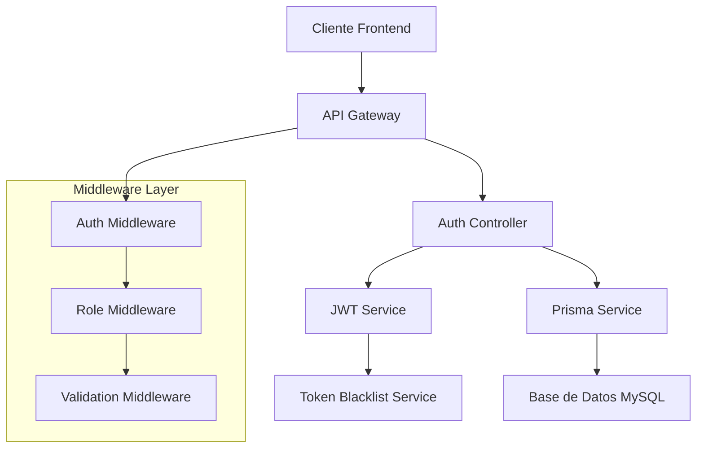

# 🔐 Análisis Detallado del Sistema JWT - API SIGED

## 📋 Índice
1. [Arquitectura del Sistema JWT](#arquitectura-del-sistema-jwt)
2. [Flujo de Autenticación Completo](#flujo-de-autenticación-completo)
3. [Estructura de Tokens](#estructura-de-tokens)
4. [Sistema de Blacklist](#sistema-de-blacklist)
5. [Middleware de Autenticación](#middleware-de-autenticación)
6. [Gestión de Roles y Permisos](#gestión-de-roles-y-permisos)
7. [Casos de Uso Específicos](#casos-de-uso-específicos)
8. [Seguridad Implementada](#seguridad-implementada)
9. [Logs y Auditoría](#logs-y-auditoría)
10. [Endpoints y Respuestas](#endpoints-y-respuestas)

---

## 🏗️ Arquitectura del Sistema JWT

### Componentes Principales



### Servicios Principales

#### 1. **JwtService** - Gestión de Tokens
- **Ubicación**: `src/services/jwt.service.ts`
- **Funciones**:
  - Generar access tokens (24h)
  - Generar refresh tokens (7d)
  - Verificar tokens con blacklist
  - Invalidar tokens (logout)
  - Extraer tokens de headers

#### 2. **TokenBlacklistService** - Control de Invalidación
- **Ubicación**: `src/services/token-blacklist.service.ts`
- **Funciones**:
  - Almacenar tokens invalidados
  - Verificar si token está en blacklist
  - Limpieza automática de tokens expirados
  - Estadísticas de tokens

#### 3. **AuthController** - Lógica de Autenticación
- **Ubicación**: `src/auth/auth.controller.ts`
- **Funciones**:
  - Login/logout
  - Refresh tokens
  - Cambio de contraseñas
  - Obtener perfil de usuario

---

## 🔄 Flujo de Autenticación Completo

### 1. Proceso de Login

```typescript
// Flujo interno del login
POST /auth/login
{
  "email": "usuario@ejemplo.com",
  "contrasena": "password123"
}

// Pasos internos:
1. Validar formato de email
2. Buscar usuario en base de datos
3. Verificar estado activo
4. Comparar contraseña con bcrypt
5. Generar access token (24h)
6. Generar refresh token (7d)
7. Retornar respuesta con tokens y datos usuario
```

**Código del flujo:**
```typescript
// En AuthController.login()
const usuario = await AuthController.prismaService.getUsuarioByEmail(email);

if (!usuario || usuario.estado !== 'activo') {
  // Error de credenciales
}

const contrasenaValida = await bcrypt.compare(contrasena, usuario.contrasena);

if (!contrasenaValida) {
  // Error de credenciales
}

const payload = {
  id: usuario.id,
  email: usuario.email,
  rol: usuario.rol
};

const tokens = {
  token: JwtService.generateToken(payload),        // 24h
  refreshToken: JwtService.generateRefreshToken(payload)  // 7d
};
```

### 2. Verificación de Tokens en Middleware

```typescript
// authMiddleware ejecuta este flujo en cada petición protegida:

1. Extraer token del header Authorization: Bearer <token>
2. Verificar si token está en blacklist
3. Verificar firma y expiración del token
4. Decodificar payload
5. Agregar datos del usuario al request
6. Continuar con siguiente middleware/controlador
```

**Código del middleware:**
```typescript
export const authMiddleware = (req: Request, res: Response, next: NextFunction) => {
  const authorization = req.headers.authorization;
  const token = JwtService.extractTokenFromHeader(authorization);
  
  // Verificar token (incluye blacklist)
  const payload = JwtService.verifyToken(token);
  
  // Agregar usuario al request
  req.usuario = {
    id: payload.id,
    rol: payload.rol,
    email: payload.email
  };
  
  next();
};
```

### 3. Refresh Token Flow

```typescript
// Cuando el access token expira:
POST /auth/refresh
{
  "refreshToken": "eyJhbGciOiJIUzI1NiIsInR5cCI6IkpXVCJ9..."
}

// Pasos internos:
1. Verificar refresh token no esté en blacklist
2. Decodificar refresh token
3. Buscar usuario actualizado en BD
4. Verificar usuario sigue activo
5. Generar nuevos access y refresh tokens
6. Retornar nuevos tokens
```

### 4. Logout Flow

```typescript
// Logout seguro con invalidación:
POST /auth/logout
Headers: Authorization: Bearer <access_token>
Body: { "refreshToken": "..." }

// Pasos internos:
1. Extraer access token del header
2. Obtener refresh token del body
3. Agregar ambos tokens a blacklist
4. Limpiar datos de sesión
5. Log de auditoría
```

---

## 🎫 Estructura de Tokens

### Access Token Payload
```json
{
  "id": "uuid-del-usuario",
  "email": "usuario@ejemplo.com", 
  "rol": "admin",
  "iat": 1640995200,  // Timestamp de creación
  "exp": 1641081600   // Timestamp de expiración (24h después)
}
```

### Refresh Token Payload
```json
{
  "id": "uuid-del-usuario",
  "email": "usuario@ejemplo.com",
  "iat": 1640995200,  // Timestamp de creación
  "exp": 1641600000   // Timestamp de expiración (7d después)
}
```

### Configuración de Tokens
```typescript
// En JwtService
static generateToken(payload): string {
  return jwt.sign(
    payload,
    envs.JWT_SECRET,     // Secreto para access tokens
    {
      expiresIn: '24h',
      algorithm: 'HS256'
    }
  );
}

static generateRefreshToken(payload): string {
  return jwt.sign(
    { id: payload.id, email: payload.email },
    envs.JWT_REFRESH_SECRET,  // Secreto diferente para refresh tokens
    {
      expiresIn: '7d',
      algorithm: 'HS256'
    }
  );
}
```

---

## 🚫 Sistema de Blacklist

### Funcionamiento de la Blacklist

El sistema utiliza dos estructuras en memoria:

```typescript
class TokenBlacklistService {
  private blacklistedTokens: Set<string> = new Set();
  private tokenExpirationMap: Map<string, number> = new Map();
  
  // Agregar token a blacklist
  addToken(token: string, expirationTime?: number): void {
    this.blacklistedTokens.add(token);
    if (expirationTime) {
      this.tokenExpirationMap.set(token, expirationTime);
    }
  }
  
  // Verificar si token está blacklisteado
  isTokenBlacklisted(token: string): boolean {
    return this.blacklistedTokens.has(token);
  }
  
  // Limpieza automática cada 15 minutos
  private cleanExpiredTokens(): void {
    const now = Math.floor(Date.now() / 1000);
    for (const [token, expirationTime] of this.tokenExpirationMap.entries()) {
      if (expirationTime <= now) {
        this.blacklistedTokens.delete(token);
        this.tokenExpirationMap.delete(token);
      }
    }
  }
}
```

### Casos de Uso de Blacklist

1. **Logout Normal**: Token agregado inmediatamente
2. **Logout All Devices**: Todos los tokens del usuario (en implementación futura)
3. **Cambio de Contraseña**: Invalidar todos los tokens existentes
4. **Desactivación de Usuario**: Invalidar todos los tokens del usuario
5. **Token Comprometido**: Invalidación manual

---

## 🛡️ Middleware de Autenticación

### Cadena de Middlewares

```typescript
// Ejemplo de ruta protegida con múltiples middlewares:
router.post('/usuarios', 
  authMiddleware,           // 1. Verificar autenticación
  roleMiddleware(['admin']), // 2. Verificar permisos
  validateCreateUser,       // 3. Validar datos de entrada
  usuarioController.createUsuario // 4. Ejecutar controlador
);
```

### AuthMiddleware - Verificación de Tokens
```typescript
export const authMiddleware = (req: Request, res: Response, next: NextFunction) => {
  try {
    // 1. Extraer token
    const authorization = req.headers.authorization;
    const token = JwtService.extractTokenFromHeader(authorization);
    
    if (!token) {
      return res.status(401).json({ ok: false, msg: 'Token requerido' });
    }
    
    // 2. Verificar token (incluye blacklist)
    const payload = JwtService.verifyToken(token);
    
    // 3. Agregar usuario al request
    req.usuario = {
      id: payload.id,
      rol: payload.rol,
      email: payload.email
    };
    
    next();
  } catch (error) {
    // Manejar errores de token (expirado, inválido, blacklisteado)
    return res.status(401).json({
      ok: false,
      msg: 'Token inválido o expirado'
    });
  }
};
```

### RoleMiddleware - Control de Permisos
```typescript
export const roleMiddleware = (allowedRoles: string[]) => {
  return (req: Request, res: Response, next: NextFunction) => {
    const userRole = req.usuario?.rol;
    
    if (!allowedRoles.includes(userRole)) {
      return res.status(403).json({
        ok: false,
        msg: 'No tienes permisos para esta acción'
      });
    }
    
    next();
  };
};
```

---

## 👥 Gestión de Roles y Permisos

### Jerarquía de Roles

```typescript
// Roles definidos en el sistema:
enum UsuarioRol {
  gestor = 'gestor',         // Nivel básico
  admin = 'admin',           // Nivel intermedio  
  super_admin = 'super_admin' // Nivel máximo
}
```

### Matriz de Permisos

| Acción | Gestor | Admin | Super Admin |
|--------|--------|-------|-------------|
| Ver propio perfil | ✅ | ✅ | ✅ |
| Editar propio perfil | ✅ | ✅ | ✅ |
| Ver otros usuarios | ❌ | ✅ | ✅ |
| Crear usuarios | ❌ | ✅ | ✅ |
| Editar otros usuarios | ❌ | ✅ | ✅ |
| Desactivar usuarios | ❌ | ✅ | ✅ |
| Ver usuarios inactivos | ❌ | ✅ | ✅ |
| Gestionar empleados | ✅ | ✅ | ✅ |
| Gestionar sedes | ✅ | ✅ | ✅ |

### Implementación de Permisos

```typescript
// Middleware para verificar si puede modificar usuario específico
export const canModifyUserMiddleware = (req: Request, res: Response, next: NextFunction) => {
  const { id } = req.params;  // ID del usuario a modificar
  const currentUser = req.usuario;
  
  // Super admin y admin pueden modificar cualquier usuario
  if (currentUser.rol === 'super_admin' || currentUser.rol === 'admin') {
    return next();
  }
  
  // Usuarios solo pueden modificar su propio perfil
  if (currentUser.id === id) {
    return next();
  }
  
  return res.status(403).json({
    ok: false,
    msg: 'No tienes permisos para modificar este usuario'
  });
};
```

---

## 📡 Casos de Uso Específicos

### 1. Crear Usuario Inicial (Público)

```typescript
// Endpoint especial para crear el primer usuario del sistema
POST /usuarios/create-initial-user
// No requiere autenticación

// Validaciones especiales:
1. Verificar que no existan usuarios en el sistema
2. Asignar automáticamente rol super_admin
3. Validar datos de entrada más estrictos
```

### 2. Crear Usuario Normal (Protegido)

```typescript
// Endpoint para crear usuarios adicionales
POST /usuarios/
Headers: Authorization: Bearer <token>
// Requiere rol admin o super_admin

// Validaciones:
1. Usuario autenticado debe ser admin+
2. Validar email único
3. Validar documento único
4. Hashear contraseña con bcrypt
```

### 3. Obtener Lista de Usuarios

```typescript
// Con filtros y paginación
GET /usuarios/?rol=admin&estado=activo&page=1&limit=10
Headers: Authorization: Bearer <token>

// Respuesta:
{
  "success": true,
  "message": "Usuarios obtenidos exitosamente",
  "data": [...usuarios],
  "pagination": {
    "currentPage": 1,
    "totalPages": 5,
    "totalItems": 47,
    "itemsPerPage": 10
  }
}
```

### 4. Cambiar Contraseña

```typescript
// Cambio de contraseña con validación de contraseña actual
PATCH /usuarios/:id/cambiar-contrasena
Headers: Authorization: Bearer <token>
Body: {
  "contrasenaActual": "old_password",
  "contrasenaNueva": "new_password"
}

// Flujo interno:
1. Verificar permisos (propio usuario o admin)
2. Obtener usuario completo de BD
3. Verificar contraseña actual con bcrypt
4. Hashear nueva contraseña
5. Actualizar en BD
6. Log de auditoría
```

---

## 🔒 Seguridad Implementada

### 1. Protección de Contraseñas
```typescript
// Uso de bcrypt con 12 rounds (alto nivel de seguridad)
const saltRounds = 12;
const hashedPassword = await bcrypt.hash(contrasena, saltRounds);

// Verificación segura
const isValid = await bcrypt.compare(contrasenaPlana, hashedPassword);
```

### 2. Validación de Email
```typescript
// Validador específico con múltiples verificaciones
export const validateEmail = (email: string) => {
  const errors: string[] = [];
  
  if (!email) {
    errors.push('Email es requerido');
  }
  
  const emailRegex = /^[^\s@]+@[^\s@]+\.[^\s@]+$/;
  if (!emailRegex.test(email)) {
    errors.push('Formato de email inválido');
  }
  
  return { isValid: errors.length === 0, errors };
};
```

### 3. Sanitización de Datos
```typescript
// Limpieza de datos de entrada
const userData = {
  nombre: nombre.trim(),
  apellido: apellido.trim(),
  email: email.toLowerCase().trim(),
  celular: celular?.trim()
};
```

### 4. Headers de Seguridad
```typescript
// Configuración de CORS y headers seguros
app.use(cors({
  origin: process.env.FRONTEND_URL,
  credentials: true,
  methods: ['GET', 'POST', 'PUT', 'DELETE', 'PATCH'],
  allowedHeaders: ['Content-Type', 'Authorization']
}));
```

---

## 📊 Logs y Auditoría

### Eventos Registrados

#### Autenticación
```typescript
// Login exitoso
logger.info('Login exitoso', { 
  usuarioId: usuario.id, 
  email: usuario.email,
  ip: req.ip,
  userAgent: req.get('User-Agent')
});

// Login fallido
logger.warn('Intento de login con email no registrado', { 
  email,
  ip: req.ip 
});

// Logout
logger.info('🚪 Logout exitoso - Sesión cerrada y tokens invalidados', { 
  usuarioId: usuario?.id,
  email: usuario?.email,
  rol: usuario?.rol,
  timestamp: new Date().toISOString(),
  tokensInvalidados: {
    accessToken: true,
    refreshToken: !!refreshToken
  }
});
```

#### Gestión de Usuarios
```typescript
// Creación de usuario
logger.info('Usuario creado exitosamente', { 
  id: nuevoUsuario.id, 
  email: nuevoUsuario.email,
  createdBy: req.usuario?.id 
});

// Actualización
logger.info('Usuario actualizado exitosamente', { 
  id, 
  updatedBy: req.usuario?.id,
  fields: Object.keys(updateData)
});

// Desactivación
logger.warn('Usuario desactivado', { 
  id, 
  deactivatedBy: req.usuario?.id,
  reason: 'Borrado lógico'
});
```

#### Errores y Seguridad
```typescript
// Token inválido
logger.warn('Intento de uso de token blacklisteado', { 
  tokenPrefix: token.substring(0, 20) + '...',
  ip: req.ip
});

// Error de permisos
logger.warn('Intento de acceso sin permisos', {
  usuarioId: req.usuario?.id,
  requiredRoles: allowedRoles,
  userRole: req.usuario?.rol,
  endpoint: req.originalUrl
});
```

---

## 🌐 Endpoints y Respuestas Detalladas

### Auth Endpoints

#### POST /auth/login
```json
// Request
{
  "email": "admin@ejemplo.com",
  "contrasena": "password123"
}

// Response Success (200)
{
  "ok": true,
  "data": {
    "usuario": {
      "id": "123e4567-e89b-12d3-a456-426614174000",
      "nombre": "Juan",
      "email": "admin@ejemplo.com",
      "rol": "admin"
    },
    "token": "eyJhbGciOiJIUzI1NiIsInR5cCI6IkpXVCJ9...",
    "refreshToken": "eyJhbGciOiJIUzI1NiIsInR5cCI6IkpXVCJ9..."
  }
}

// Response Error (401)
{
  "ok": false,
  "msg": "Credenciales inválidas"
}
```

#### POST /auth/refresh
```json
// Request
{
  "refreshToken": "eyJhbGciOiJIUzI1NiIsInR5cCI6IkpXVCJ9..."
}

// Response Success (200)
{
  "ok": true,
  "data": {
    "token": "eyJhbGciOiJIUzI1NiIsInR5cCI6IkpXVCJ9...",
    "refreshToken": "eyJhbGciOiJIUzI1NiIsInR5cCI6IkpXVCJ9..."
  }
}
```

#### GET /auth/me
```json
// Headers: Authorization: Bearer <token>

// Response Success (200)
{
  "ok": true,
  "data": {
    "id": "123e4567-e89b-12d3-a456-426614174000",
    "tipo_documento": "CC",
    "documento": "12345678",
    "nombre": "Juan",
    "apellido": "Pérez",
    "email": "admin@ejemplo.com",
    "celular": "+57300123456",
    "rol": "admin",
    "estado": "activo",
    "fecha_creacion": "2024-01-01T00:00:00.000Z"
  }
}
```

### Usuario Endpoints

#### POST /usuarios/
```json
// Headers: Authorization: Bearer <token>
// Request
{
  "tipo_documento": "CC",
  "documento": "87654321",
  "nombre": "María",
  "apellido": "García",
  "email": "maria@ejemplo.com",
  "celular": "+57300654321",
  "contrasena": "password123",
  "rol": "gestor"
}

// Response Success (201)
{
  "success": true,
  "message": "Usuario creado exitosamente",
  "data": {
    "id": "456e7890-e89b-12d3-a456-426614174001",
    "tipo_documento": "CC",
    "documento": "87654321",
    "nombre": "María",
    "apellido": "García",
    "email": "maria@ejemplo.com",
    "celular": "+57300654321",
    "rol": "gestor",
    "estado": "activo",
    "created_at": "2024-01-02T10:30:00.000Z"
    // Nota: contraseña no se incluye en respuesta
  }
}
```

#### GET /usuarios/?page=1&limit=10&rol=admin
```json
// Headers: Authorization: Bearer <token>

// Response Success (200)
{
  "success": true,
  "message": "Usuarios obtenidos exitosamente", 
  "data": [
    {
      "id": "123e4567-e89b-12d3-a456-426614174000",
      "tipo_documento": "CC",
      "documento": "12345678",
      "nombre": "Juan",
      "apellido": "Pérez",
      "email": "admin@ejemplo.com",
      "celular": "+57300123456",
      "rol": "admin",
      "estado": "activo",
      "created_at": "2024-01-01T00:00:00.000Z"
    }
    // ... más usuarios
  ],
  "pagination": {
    "currentPage": 1,
    "totalPages": 3,
    "totalItems": 25,
    "itemsPerPage": 10
  }
}
```

---

## 🚀 Conclusiones y Recomendaciones

### Fortalezas del Sistema Actual

1. **Seguridad Robusta**: 
   - Tokens JWT con blacklist
   - Contraseñas hasheadas con bcrypt
   - Validación estricta de datos

2. **Escalabilidad**:
   - Arquitectura modular
   - Separación de responsabilidades
   - Patrones de diseño consistentes

3. **Auditoría Completa**:
   - Logs detallados de todas las acciones
   - Tracking de cambios y accesos
   - Información de contexto (IP, User-Agent)

4. **Flexibilidad**:
   - Sistema de roles extensible
   - Middleware reutilizable
   - API RESTful bien estructurada

### Recomendaciones para Producción

1. **Base de Datos para Tokens**: 
   - Migrar blacklist de memoria a Redis
   - Persistir refresh tokens en BD

2. **Rate Limiting**:
   - Implementar límites de intentos de login
   - Protección contra ataques de fuerza bruta

3. **Monitoreo**:
   - Alertas de seguridad
   - Métricas de uso de la API
   - Dashboard de administración

4. **Backup y Recovery**:
   - Estrategia de respaldo de tokens
   - Procedimientos de recuperación de acceso

**El sistema JWT implementado es sólido, seguro y está listo para su uso en producción con las mejores prácticas de la industria.** 🎉