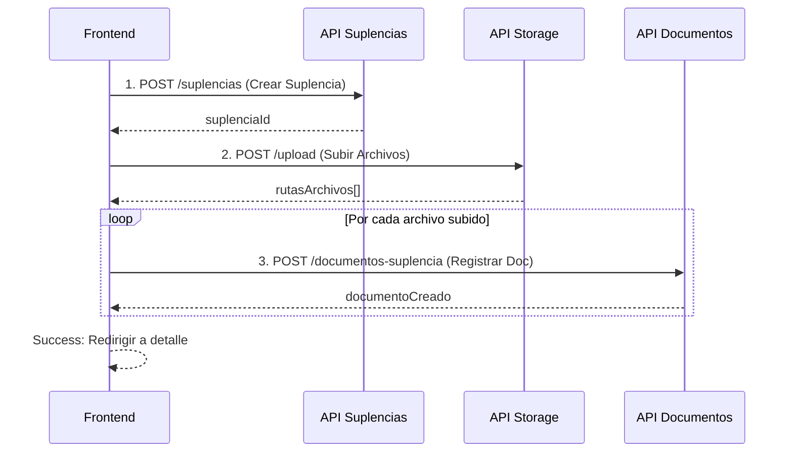

# 🔄 Documentación Completa - Módulo de Suplencias API SIGED

## 📋 Índice
1. [Descripción General](#descripción-general)
2. [Autenticación JWT](#autenticación-jwt)
3. [Estructura de Datos](#estructura-de-datos)
4. [Endpoints del API](#endpoints-del-api)
5. [Flujo de Creación con 3 Promesas](#flujo-de-creación-con-3-promesas)
6. [Implementación Next.js + TypeScript](#implementación-nextjs--typescript)
7. [Servicios para el Frontend](#servicios-para-el-frontend)
8. [Componentes React/Next.js](#componentes-reactnextjs)
9. [Manejo de Archivos](#manejo-de-archivos)
10. [Códigos de Error](#códigos-de-error)

---

## 🏢 Descripción General

El módulo de **Suplencias** gestiona los reemplazos de docentes cuando están ausentes. Registra:
- **Docente ausente** y causa de ausencia
- **Docente de reemplazo** que cubre las horas
- **Sede** donde ocurre la suplencia
- **Fechas** de ausencia y reemplazo
- **Horas cubiertas** y jornada
- **Documentos** de soporte (certificados médicos, permisos, etc.)

---

## 🔐 Autenticación JWT

### Headers Requeridos en Todas las Peticiones

```typescript
const headers = {
  'Authorization': `Bearer ${token}`,
  'Content-Type': 'application/json'
};
```

### Permisos por Rol

| Acción | Gestor | Admin | Super Admin |
|--------|--------|-------|-------------|
| Ver suplencias | ✅ | ✅ | ✅ |
| Crear suplencia | ✅ | ✅ | ✅ |
| Editar suplencia | ✅ | ✅ | ✅ |
| Ver estadísticas | ✅ | ✅ | ✅ |
| Subir documentos | ✅ | ✅ | ✅ |
| Eliminar suplencia | ❌ | ❌ | ✅ |
| Eliminar documentos | ❌ | ❌ | ✅ |

---

## 📊 Estructura de Datos

### Interface de Suplencia

```typescript
interface ICreateSuplencia {
  docente_ausente_id: string;          // UUID del docente ausente
  causa_ausencia: string;              // Motivo de ausencia
  fecha_inicio_ausencia: Date | string; // Fecha inicio ausencia
  fecha_fin_ausencia: Date | string;   // Fecha fin ausencia
  sede_id: string;                     // UUID de la sede
  docente_reemplazo_id: string;        // UUID del docente que reemplaza
  fecha_inicio_reemplazo: Date | string; // Fecha inicio reemplazo
  fecha_fin_reemplazo: Date | string;  // Fecha fin reemplazo
  horas_cubiertas: number;             // Horas totales cubiertas (1-24)
  jornada: 'ma_ana' | 'tarde' | 'sabatina'; // Jornada de la suplencia
  observacion?: string;                // Observaciones adicionales
}

interface IUpdateSuplencia {
  docente_ausente_id?: string;
  causa_ausencia?: string;
  fecha_inicio_ausencia?: Date | string;
  fecha_fin_ausencia?: Date | string;
  sede_id?: string;
  docente_reemplazo_id?: string;
  fecha_inicio_reemplazo?: Date | string;
  fecha_fin_reemplazo?: Date | string;
  horas_cubiertas?: number;
  jornada?: 'ma_ana' | 'tarde' | 'sabatina';
  observacion?: string;
}

interface Suplencia {
  id: string;
  docente_ausente_id: string;
  causa_ausencia: string;
  fecha_inicio_ausencia: Date;
  fecha_fin_ausencia: Date;
  sede_id: string;
  docente_reemplazo_id: string;
  fecha_inicio_reemplazo: Date;
  fecha_fin_reemplazo: Date;
  horas_cubiertas: number;
  jornada: 'ma_ana' | 'tarde' | 'sabatina';
  observacion?: string | null;
  created_at: Date;
  
  // Relaciones incluidas
  empleado_suplencias_docente_ausente_idToempleado: {
    id: string;
    nombre: string;
    apellido: string;
    documento: string;
    email: string;
    cargo: string;
  };
  empleado_suplencias_docente_reemplazo_idToempleado: {
    id: string;
    nombre: string;
    apellido: string;
    documento: string;
    email: string;
    cargo: string;
  };
  sede: {
    id: string;
    nombre: string;
    zona: 'urbana' | 'rural';
    direccion: string;
  };
  documentos_suplencia?: DocumentoSuplencia[];
  _count?: {
    documentos_suplencia: number;
  };
}
```

### Interface de Documento de Suplencia

```typescript
interface ICreateDocumentoSuplencia {
  suplencia_id: string;  // UUID de la suplencia
  nombre: string;        // Nombre del archivo
  ruta_relativa: string; // Ruta donde se guardó el archivo
}

interface DocumentoSuplencia {
  id: string;
  suplencia_id: string;
  nombre: string;
  ruta_relativa: string;
  created_at: Date;
}
```

### Jornadas Disponibles

```typescript
type Jornada = 'ma_ana' | 'tarde' | 'sabatina';

const jornadas = [
  { valor: 'ma_ana', descripcion: 'Mañana', ejemplo: '7:00 AM - 12:00 PM' },
  { valor: 'tarde', descripcion: 'Tarde', ejemplo: '12:00 PM - 6:00 PM' },
  { valor: 'sabatina', descripcion: 'Sabatina', ejemplo: '7:00 AM - 12:00 PM (Sábados)' }
];
```

---

## 🌐 Endpoints del API

### Base URL
```
https://api-siged.com/api/v1
```

### 1. **Obtener Jornadas Disponibles**

#### `GET /suplencias/jornadas`

**Headers:**
```http
Authorization: Bearer <token>
```

**Response Success (200):**
```json
{
  "success": true,
  "message": "Jornadas disponibles obtenidas exitosamente",
  "data": [
    {
      "valor": "ma_ana",
      "descripcion": "Mañana",
      "ejemplo": "Suplencia de 7:00 AM a 12:00 PM"
    },
    {
      "valor": "tarde",
      "descripcion": "Tarde",
      "ejemplo": "Suplencia de 12:00 PM a 6:00 PM"
    },
    {
      "valor": "sabatina",
      "descripcion": "Sabatina",
      "ejemplo": "Suplencia de 7:00 AM a 12:00 PM los sábados"
    }
  ]
}
```

### 2. **Crear Suplencia**

#### `POST /suplencias/`

**Headers:**
```http
Authorization: Bearer <token>
Content-Type: application/json
```

**Body:**
```json
{
  "docente_ausente_id": "uuid-docente-ausente",
  "causa_ausencia": "Incapacidad médica",
  "fecha_inicio_ausencia": "2024-01-15",
  "fecha_fin_ausencia": "2024-01-19",
  "sede_id": "uuid-sede",
  "docente_reemplazo_id": "uuid-docente-reemplazo",
  "fecha_inicio_reemplazo": "2024-01-15",
  "fecha_fin_reemplazo": "2024-01-19",
  "horas_cubiertas": 20,
  "jornada": "ma_ana",
  "observacion": "Certificado médico adjunto"
}
```

**Response Success (201):**
```json
{
  "success": true,
  "message": "Suplencia creada exitosamente",
  "data": {
    "id": "uuid-suplencia",
    "docente_ausente_id": "uuid-docente-ausente",
    "causa_ausencia": "Incapacidad médica",
    "fecha_inicio_ausencia": "2024-01-15T00:00:00.000Z",
    "fecha_fin_ausencia": "2024-01-19T00:00:00.000Z",
    "sede_id": "uuid-sede",
    "docente_reemplazo_id": "uuid-docente-reemplazo",
    "fecha_inicio_reemplazo": "2024-01-15T00:00:00.000Z",
    "fecha_fin_reemplazo": "2024-01-19T00:00:00.000Z",
    "horas_cubiertas": 20,
    "jornada": "ma_ana",
    "observacion": "Certificado médico adjunto",
    "created_at": "2024-01-15T10:30:00.000Z",
    "empleado_suplencias_docente_ausente_idToempleado": {
      "id": "uuid-docente-ausente",
      "nombre": "Juan",
      "apellido": "Pérez",
      "documento": "12345678",
      "email": "juan.perez@colegio.edu.co",
      "cargo": "Docente"
    },
    "empleado_suplencias_docente_reemplazo_idToempleado": {
      "id": "uuid-docente-reemplazo",
      "nombre": "María",
      "apellido": "García",
      "documento": "87654321",
      "email": "maria.garcia@colegio.edu.co",
      "cargo": "Docente"
    },
    "sede": {
      "id": "uuid-sede",
      "nombre": "Sede Principal",
      "zona": "urbana",
      "direccion": "Calle 123 #45-67"
    }
  }
}
```

**Response Error (400):**
```json
{
  "success": false,
  "message": "Faltan datos requeridos: docente_ausente_id, causa_ausencia, ...",
  "error": "Validation Error"
}
```

### 3. **Obtener Lista de Suplencias**

#### `GET /suplencias/?page=1&limit=10`

**Headers:**
```http
Authorization: Bearer <token>
```

**Query Parameters:**
```typescript
{
  page?: number;                  // Página (default: 1)
  limit?: number;                 // Items por página (default: 10, max: 50)
  search?: string;                // Búsqueda general
  docente_ausente_id?: string;    // Filtrar por docente ausente
  docente_reemplazo_id?: string;  // Filtrar por docente reemplazo
  sede_id?: string;               // Filtrar por sede
  jornada?: string;               // Filtrar por jornada
  fecha_inicio?: string;          // Filtrar desde fecha
  fecha_fin?: string;             // Filtrar hasta fecha
  causa_ausencia?: string;        // Filtrar por causa
}
```

**Response Success (200):**
```json
{
  "success": true,
  "message": "Suplencias obtenidas exitosamente",
  "data": [
    {
      "id": "uuid-suplencia",
      "docente_ausente_id": "uuid-ausente",
      "causa_ausencia": "Incapacidad médica",
      "fecha_inicio_ausencia": "2024-01-15T00:00:00.000Z",
      "fecha_fin_ausencia": "2024-01-19T00:00:00.000Z",
      "horas_cubiertas": 20,
      "jornada": "ma_ana",
      "empleado_suplencias_docente_ausente_idToempleado": {
        "nombre": "Juan",
        "apellido": "Pérez"
      },
      "empleado_suplencias_docente_reemplazo_idToempleado": {
        "nombre": "María",
        "apellido": "García"
      },
      "sede": {
        "nombre": "Sede Principal"
      },
      "_count": {
        "documentos_suplencia": 2
      }
    }
  ],
  "pagination": {
    "currentPage": 1,
    "totalPages": 5,
    "totalItems": 47,
    "itemsPerPage": 10,
    "hasNextPage": true,
    "hasPrevPage": false
  }
}
```

### 4. **Obtener Suplencia por ID**

#### `GET /suplencias/:id`

**Headers:**
```http
Authorization: Bearer <token>
```

**Response Success (200):**
```json
{
  "success": true,
  "message": "Suplencia obtenida exitosamente",
  "data": {
    "id": "uuid-suplencia",
    "docente_ausente_id": "uuid-ausente",
    "causa_ausencia": "Incapacidad médica",
    "fecha_inicio_ausencia": "2024-01-15T00:00:00.000Z",
    "fecha_fin_ausencia": "2024-01-19T00:00:00.000Z",
    "sede_id": "uuid-sede",
    "docente_reemplazo_id": "uuid-reemplazo",
    "fecha_inicio_reemplazo": "2024-01-15T00:00:00.000Z",
    "fecha_fin_reemplazo": "2024-01-19T00:00:00.000Z",
    "horas_cubiertas": 20,
    "jornada": "ma_ana",
    "observacion": "Certificado médico adjunto",
    "created_at": "2024-01-15T10:30:00.000Z",
    "empleado_suplencias_docente_ausente_idToempleado": { /* ... */ },
    "empleado_suplencias_docente_reemplazo_idToempleado": { /* ... */ },
    "sede": { /* ... */ },
    "documentos_suplencia": [
      {
        "id": "uuid-doc",
        "nombre": "certificado_medico.pdf",
        "ruta_relativa": "/suplencias/2024/01/certificado_medico.pdf",
        "created_at": "2024-01-15T10:35:00.000Z"
      }
    ]
  }
}
```

### 5. **Crear Documento de Suplencia**

#### `POST /documentos-suplencia/`

**Headers:**
```http
Authorization: Bearer <token>
Content-Type: application/json
```

**Body:**
```json
{
  "suplencia_id": "uuid-suplencia",
  "nombre": "certificado_medico.pdf",
  "ruta_relativa": "/suplencias/2024/01/certificado_medico.pdf"
}
```

**Response Success (201):**
```json
{
  "success": true,
  "message": "Documento de suplencia creado exitosamente",
  "data": {
    "id": "uuid-documento",
    "suplencia_id": "uuid-suplencia",
    "nombre": "certificado_medico.pdf",
    "ruta_relativa": "/suplencias/2024/01/certificado_medico.pdf",
    "created_at": "2024-01-15T10:35:00.000Z",
    "suplencias": {
      "id": "uuid-suplencia",
      "causa_ausencia": "Incapacidad médica",
      "empleado_suplencias_docente_ausente_idToempleado": {
        "nombre": "Juan",
        "apellido": "Pérez"
      }
    }
  }
}
```

### 6. **Obtener Documentos por Suplencia**

#### `GET /documentos-suplencia/suplencia/:suplencia_id`

**Headers:**
```http
Authorization: Bearer <token>
```

**Response Success (200):**
```json
{
  "success": true,
  "message": "Documentos obtenidos exitosamente",
  "data": [
    {
      "id": "uuid-doc-1",
      "nombre": "certificado_medico.pdf",
      "ruta_relativa": "/suplencias/2024/01/certificado_medico.pdf",
      "created_at": "2024-01-15T10:35:00.000Z"
    },
    {
      "id": "uuid-doc-2",
      "nombre": "permiso_laboral.pdf",
      "ruta_relativa": "/suplencias/2024/01/permiso_laboral.pdf",
      "created_at": "2024-01-15T10:36:00.000Z"
    }
  ],
  "suplencia": {
    "id": "uuid-suplencia",
    "causa_ausencia": "Incapacidad médica",
    "empleado_suplencias_docente_ausente_idToempleado": {
      "nombre": "Juan",
      "apellido": "Pérez"
    }
  },
  "total_documentos": 2
}
```

### 7. **Actualizar Suplencia**

#### `PUT /suplencias/:id`

**Headers:**
```http
Authorization: Bearer <token>
Content-Type: application/json
```

**Body:**
```json
{
  "causa_ausencia": "Incapacidad médica prolongada",
  "fecha_fin_ausencia": "2024-01-22",
  "fecha_fin_reemplazo": "2024-01-22",
  "horas_cubiertas": 28,
  "observacion": "Extensión de incapacidad médica"
}
```

**Response Success (200):**
```json
{
  "success": true,
  "message": "Suplencia actualizada exitosamente",
  "data": { /* Suplencia actualizada completa */ }
}
```

### 8. **Eliminar Suplencia (Solo Super Admin)**

#### `DELETE /suplencias/:id`

**Headers:**
```http
Authorization: Bearer <token>
```

**Response Success (200):**
```json
{
  "success": true,
  "message": "Suplencia eliminada exitosamente",
  "data": {
    "id": "uuid-suplencia",
    "causa_ausencia": "Incapacidad médica",
    "docente_ausente": "Juan Pérez",
    "docente_reemplazo": "María García",
    "sede": "Sede Principal"
  }
}
```

### 9. **Obtener Estadísticas**

#### `GET /suplencias/estadisticas?empleado_id=uuid&sede_id=uuid&año=2024`

**Headers:**
```http
Authorization: Bearer <token>
```

**Response Success (200):**
```json
{
  "success": true,
  "message": "Estadísticas obtenidas exitosamente",
  "data": {
    "total_suplencias": 47,
    "horas_totales_cubiertas": 940,
    "suplencias_por_jornada": [
      {
        "jornada": "ma_ana",
        "cantidad": 25,
        "horas_totales": 500,
        "porcentaje": "53.19"
      },
      {
        "jornada": "tarde",
        "cantidad": 18,
        "horas_totales": 360,
        "porcentaje": "38.30"
      },
      {
        "jornada": "sabatina",
        "cantidad": 4,
        "horas_totales": 80,
        "porcentaje": "8.51"
      }
    ],
    "suplencias_recientes": [ /* 10 más recientes */ ],
    "empleado_filtrado": true,
    "sede_filtrada": true,
    "año_filtrado": "2024"
  }
}
```

---

## 🔄 Flujo de Creación con 3 Promesas

### Diagrama del Flujo



### Implementación del Flujo

```typescript
// Flujo completo en 3 pasos encadenados
async function crearSuplenciaCompleta(
  dataSuplencia: ICreateSuplencia,
  archivos: File[]
): Promise<ResultadoCompleto> {
  
  try {
    // ===== PROMESA 1: Crear la suplencia =====
    const suplencia = await crearSuplencia(dataSuplencia);
    console.log('✅ Paso 1: Suplencia creada', suplencia.id);
    
    // ===== PROMESA 2: Subir archivos al storage =====
    const rutasArchivos = await subirArchivos(archivos, suplencia.id);
    console.log('✅ Paso 2: Archivos subidos', rutasArchivos.length);
    
    // ===== PROMESA 3: Registrar documentos en la BD =====
    const documentos = await registrarDocumentos(
      suplencia.id,
      rutasArchivos
    );
    console.log('✅ Paso 3: Documentos registrados', documentos.length);
    
    return {
      success: true,
      suplencia,
      documentos
    };
    
  } catch (error) {
    console.error('❌ Error en flujo completo:', error);
    throw error;
  }
}
```

---

## 💻 Implementación Next.js + TypeScript

### 1. **Servicio de Suplencias**

```typescript
// services/suplencia.service.ts
import axios from 'axios';

const API_URL = process.env.NEXT_PUBLIC_API_URL || 'http://localhost:3000/api/v1';

// Obtener token de autenticación
const getAuthHeader = () => {
  const token = localStorage.getItem('siged_access_token');
  return {
    'Authorization': `Bearer ${token}`,
    'Content-Type': 'application/json'
  };
};

export interface ICreateSuplencia {
  docente_ausente_id: string;
  causa_ausencia: string;
  fecha_inicio_ausencia: string;
  fecha_fin_ausencia: string;
  sede_id: string;
  docente_reemplazo_id: string;
  fecha_inicio_reemplazo: string;
  fecha_fin_reemplazo: string;
  horas_cubiertas: number;
  jornada: 'ma_ana' | 'tarde' | 'sabatina';
  observacion?: string;
}

export interface Suplencia {
  id: string;
  docente_ausente_id: string;
  causa_ausencia: string;
  fecha_inicio_ausencia: string;
  fecha_fin_ausencia: string;
  sede_id: string;
  docente_reemplazo_id: string;
  fecha_inicio_reemplazo: string;
  fecha_fin_reemplazo: string;
  horas_cubiertas: number;
  jornada: string;
  observacion?: string;
  created_at: string;
  empleado_suplencias_docente_ausente_idToempleado: any;
  empleado_suplencias_docente_reemplazo_idToempleado: any;
  sede: any;
  documentos_suplencia?: any[];
}

export class SuplenciaService {
  
  // ===== PROMESA 1: Crear Suplencia =====
  static async crearSuplencia(data: ICreateSuplencia): Promise<Suplencia> {
    try {
      const response = await axios.post(
        `${API_URL}/suplencias`,
        data,
        { headers: getAuthHeader() }
      );
      
      if (response.data.success) {
        console.log('✅ Suplencia creada:', response.data.data.id);
        return response.data.data;
      }
      
      throw new Error(response.data.message || 'Error creando suplencia');
    } catch (error: any) {
      console.error('❌ Error en crearSuplencia:', error);
      throw new Error(
        error.response?.data?.message || 
        error.message || 
        'Error al crear suplencia'
      );
    }
  }
  
  // ===== PROMESA 2: Subir Archivos =====
  static async subirArchivos(
    archivos: File[],
    suplenciaId: string
  ): Promise<Array<{ nombre: string; ruta: string }>> {
    try {
      const formData = new FormData();
      
      // Agregar cada archivo al FormData
      archivos.forEach((archivo, index) => {
        formData.append(`archivo_${index}`, archivo);
      });
      
      // Agregar metadata
      formData.append('suplencia_id', suplenciaId);
      formData.append('tipo', 'suplencia');
      
      const token = localStorage.getItem('siged_access_token');
      
      const response = await axios.post(
        `${API_URL}/upload/suplencias`,
        formData,
        {
          headers: {
            'Authorization': `Bearer ${token}`,
            'Content-Type': 'multipart/form-data'
          }
        }
      );
      
      if (response.data.success) {
        console.log('✅ Archivos subidos:', response.data.data.length);
        return response.data.data;
      }
      
      throw new Error(response.data.message || 'Error subiendo archivos');
    } catch (error: any) {
      console.error('❌ Error en subirArchivos:', error);
      throw new Error(
        error.response?.data?.message || 
        error.message || 
        'Error al subir archivos'
      );
    }
  }
  
  // ===== PROMESA 3: Registrar Documentos en BD =====
  static async registrarDocumentos(
    suplenciaId: string,
    archivos: Array<{ nombre: string; ruta: string }>
  ): Promise<any[]> {
    try {
      const promesasDocumentos = archivos.map(archivo =>
        axios.post(
          `${API_URL}/documentos-suplencia`,
          {
            suplencia_id: suplenciaId,
            nombre: archivo.nombre,
            ruta_relativa: archivo.ruta
          },
          { headers: getAuthHeader() }
        )
      );
      
      const responses = await Promise.all(promesasDocumentos);
      
      const documentos = responses.map(res => res.data.data);
      console.log('✅ Documentos registrados:', documentos.length);
      
      return documentos;
    } catch (error: any) {
      console.error('❌ Error en registrarDocumentos:', error);
      throw new Error(
        error.response?.data?.message || 
        error.message || 
        'Error al registrar documentos'
      );
    }
  }
  
  // ===== FLUJO COMPLETO: 3 Promesas Encadenadas =====
  static async crearSuplenciaCompleta(
    dataSuplencia: ICreateSuplencia,
    archivos: File[]
  ): Promise<{
    success: boolean;
    suplencia: Suplencia;
    documentos: any[];
  }> {
    try {
      console.log('🚀 Iniciando flujo completo de creación de suplencia...');
      
      // PASO 1: Crear suplencia
      console.log('📝 Paso 1/3: Creando suplencia...');
      const suplencia = await this.crearSuplencia(dataSuplencia);
      
      // Si no hay archivos, terminar aquí
      if (!archivos || archivos.length === 0) {
        console.log('✅ Suplencia creada sin documentos');
        return {
          success: true,
          suplencia,
          documentos: []
        };
      }
      
      // PASO 2: Subir archivos
      console.log('📤 Paso 2/3: Subiendo archivos...');
      const rutasArchivos = await this.subirArchivos(archivos, suplencia.id);
      
      // PASO 3: Registrar documentos
      console.log('📋 Paso 3/3: Registrando documentos en BD...');
      const documentos = await this.registrarDocumentos(
        suplencia.id,
        rutasArchivos
      );
      
      console.log('✅ Flujo completo finalizado exitosamente');
      
      return {
        success: true,
        suplencia,
        documentos
      };
      
    } catch (error: any) {
      console.error('❌ Error en flujo completo:', error);
      throw error;
    }
  }
  
  // Obtener suplencias
  static async getSuplencias(params: any = {}): Promise<any> {
    try {
      const queryString = new URLSearchParams(params).toString();
      const response = await axios.get(
        `${API_URL}/suplencias?${queryString}`,
        { headers: getAuthHeader() }
      );
      
      return response.data;
    } catch (error: any) {
      console.error('❌ Error obteniendo suplencias:', error);
      throw error;
    }
  }
  
  // Obtener suplencia por ID
  static async getSuplenciaById(id: string): Promise<Suplencia> {
    try {
      const response = await axios.get(
        `${API_URL}/suplencias/${id}`,
        { headers: getAuthHeader() }
      );
      
      if (response.data.success) {
        return response.data.data;
      }
      
      throw new Error(response.data.message);
    } catch (error: any) {
      console.error(`❌ Error obteniendo suplencia ${id}:`, error);
      throw error;
    }
  }
  
  // Actualizar suplencia
  static async updateSuplencia(
    id: string,
    data: Partial<ICreateSuplencia>
  ): Promise<Suplencia> {
    try {
      const response = await axios.put(
        `${API_URL}/suplencias/${id}`,
        data,
        { headers: getAuthHeader() }
      );
      
      if (response.data.success) {
        console.log('✅ Suplencia actualizada:', id);
        return response.data.data;
      }
      
      throw new Error(response.data.message);
    } catch (error: any) {
      console.error(`❌ Error actualizando suplencia ${id}:`, error);
      throw error;
    }
  }
  
  // Eliminar suplencia (solo super_admin)
  static async deleteSuplencia(id: string): Promise<boolean> {
    try {
      const response = await axios.delete(
        `${API_URL}/suplencias/${id}`,
        { headers: getAuthHeader() }
      );
      
      if (response.data.success) {
        console.log('✅ Suplencia eliminada:', id);
        return true;
      }
      
      throw new Error(response.data.message);
    } catch (error: any) {
      console.error(`❌ Error eliminando suplencia ${id}:`, error);
      throw error;
    }
  }
  
  // Obtener jornadas disponibles
  static async getJornadas(): Promise<any[]> {
    try {
      const response = await axios.get(
        `${API_URL}/suplencias/jornadas`,
        { headers: getAuthHeader() }
      );
      
      return response.data.data;
    } catch (error: any) {
      console.error('❌ Error obteniendo jornadas:', error);
      throw error;
    }
  }
  
  // Obtener estadísticas
  static async getEstadisticas(params: any = {}): Promise<any> {
    try {
      const queryString = new URLSearchParams(params).toString();
      const response = await axios.get(
        `${API_URL}/suplencias/estadisticas?${queryString}`,
        { headers: getAuthHeader() }
      );
      
      return response.data.data;
    } catch (error: any) {
      console.error('❌ Error obteniendo estadísticas:', error);
      throw error;
    }
  }
}

export default SuplenciaService;
```

---

## 🎨 Componentes React/Next.js

### 1. **Formulario de Creación de Suplencia**

```typescript
// app/suplencias/crear/page.tsx
'use client';

import { useState, useEffect } from 'react';
import { useRouter } from 'next/navigation';
import SuplenciaService, { ICreateSuplencia } from '@/services/suplencia.service';

export default function CrearSuplenciaPage() {
  const router = useRouter();
  const [isLoading, setIsLoading] = useState(false);
  const [error, setError] = useState<string | null>(null);
  const [progress, setProgress] = useState<string>('');
  
  const [formData, setFormData] = useState<ICreateSuplencia>({
    docente_ausente_id: '',
    causa_ausencia: '',
    fecha_inicio_ausencia: '',
    fecha_fin_ausencia: '',
    sede_id: '',
    docente_reemplazo_id: '',
    fecha_inicio_reemplazo: '',
    fecha_fin_reemplazo: '',
    horas_cubiertas: 0,
    jornada: 'ma_ana',
    observacion: ''
  });
  
  const [archivos, setArchivos] = useState<File[]>([]);
  
  // Cargar datos necesarios (docentes, sedes, etc.)
  useEffect(() => {
    // Cargar docentes y sedes para los selects
  }, []);
  
  const handleSubmit = async (e: React.FormEvent) => {
    e.preventDefault();
    setIsLoading(true);
    setError(null);
    
    try {
      // ===== FLUJO COMPLETO: 3 PROMESAS ENCADENADAS =====
      
      setProgress('📝 Creando suplencia...');
      const resultado = await SuplenciaService.crearSuplenciaCompleta(
        formData,
        archivos
      );
      
      console.log('✅ Resultado completo:', resultado);
      
      // Redirigir al detalle de la suplencia creada
      router.push(`/suplencias/${resultado.suplencia.id}`);
      
    } catch (error: any) {
      console.error('❌ Error:', error);
      setError(error.message || 'Error al crear suplencia');
    } finally {
      setIsLoading(false);
      setProgress('');
    }
  };
  
  const handleFileChange = (e: React.ChangeEvent<HTMLInputElement>) => {
    if (e.target.files) {
      const nuevosArchivos = Array.from(e.target.files);
      setArchivos(prev => [...prev, ...nuevosArchivos]);
    }
  };
  
  const removeFile = (index: number) => {
    setArchivos(prev => prev.filter((_, i) => i !== index));
  };
  
  return (
    <div className="max-w-4xl mx-auto p-6">
      <h1 className="text-3xl font-bold mb-6">Crear Nueva Suplencia</h1>
      
      {error && (
        <div className="bg-red-50 border border-red-200 text-red-700 px-4 py-3 rounded mb-6">
          {error}
        </div>
      )}
      
      {progress && (
        <div className="bg-blue-50 border border-blue-200 text-blue-700 px-4 py-3 rounded mb-6">
          {progress}
        </div>
      )}
      
      <form onSubmit={handleSubmit} className="space-y-6">
        {/* Información del Docente Ausente */}
        <div className="bg-white p-6 rounded-lg shadow">
          <h2 className="text-xl font-semibold mb-4">Docente Ausente</h2>
          
          <div className="grid grid-cols-1 md:grid-cols-2 gap-4">
            <div>
              <label className="block text-sm font-medium text-gray-700 mb-1">
                Docente Ausente *
              </label>
              <select
                value={formData.docente_ausente_id}
                onChange={(e) => setFormData({
                  ...formData,
                  docente_ausente_id: e.target.value
                })}
                className="w-full px-3 py-2 border border-gray-300 rounded-md"
                required
              >
                <option value="">Seleccionar docente...</option>
                {/* Opciones de docentes */}
              </select>
            </div>
            
            <div>
              <label className="block text-sm font-medium text-gray-700 mb-1">
                Causa de Ausencia *
              </label>
              <input
                type="text"
                value={formData.causa_ausencia}
                onChange={(e) => setFormData({
                  ...formData,
                  causa_ausencia: e.target.value
                })}
                className="w-full px-3 py-2 border border-gray-300 rounded-md"
                placeholder="Ej: Incapacidad médica"
                required
              />
            </div>
            
            <div>
              <label className="block text-sm font-medium text-gray-700 mb-1">
                Fecha Inicio Ausencia *
              </label>
              <input
                type="date"
                value={formData.fecha_inicio_ausencia}
                onChange={(e) => setFormData({
                  ...formData,
                  fecha_inicio_ausencia: e.target.value
                })}
                className="w-full px-3 py-2 border border-gray-300 rounded-md"
                required
              />
            </div>
            
            <div>
              <label className="block text-sm font-medium text-gray-700 mb-1">
                Fecha Fin Ausencia *
              </label>
              <input
                type="date"
                value={formData.fecha_fin_ausencia}
                onChange={(e) => setFormData({
                  ...formData,
                  fecha_fin_ausencia: e.target.value
                })}
                className="w-full px-3 py-2 border border-gray-300 rounded-md"
                required
              />
            </div>
          </div>
        </div>
        
        {/* Información del Reemplazo */}
        <div className="bg-white p-6 rounded-lg shadow">
          <h2 className="text-xl font-semibold mb-4">Docente de Reemplazo</h2>
          
          <div className="grid grid-cols-1 md:grid-cols-2 gap-4">
            <div>
              <label className="block text-sm font-medium text-gray-700 mb-1">
                Docente Reemplazo *
              </label>
              <select
                value={formData.docente_reemplazo_id}
                onChange={(e) => setFormData({
                  ...formData,
                  docente_reemplazo_id: e.target.value
                })}
                className="w-full px-3 py-2 border border-gray-300 rounded-md"
                required
              >
                <option value="">Seleccionar docente...</option>
                {/* Opciones de docentes */}
              </select>
            </div>
            
            <div>
              <label className="block text-sm font-medium text-gray-700 mb-1">
                Sede *
              </label>
              <select
                value={formData.sede_id}
                onChange={(e) => setFormData({
                  ...formData,
                  sede_id: e.target.value
                })}
                className="w-full px-3 py-2 border border-gray-300 rounded-md"
                required
              >
                <option value="">Seleccionar sede...</option>
                {/* Opciones de sedes */}
              </select>
            </div>
            
            <div>
              <label className="block text-sm font-medium text-gray-700 mb-1">
                Fecha Inicio Reemplazo *
              </label>
              <input
                type="date"
                value={formData.fecha_inicio_reemplazo}
                onChange={(e) => setFormData({
                  ...formData,
                  fecha_inicio_reemplazo: e.target.value
                })}
                className="w-full px-3 py-2 border border-gray-300 rounded-md"
                required
              />
            </div>
            
            <div>
              <label className="block text-sm font-medium text-gray-700 mb-1">
                Fecha Fin Reemplazo *
              </label>
              <input
                type="date"
                value={formData.fecha_fin_reemplazo}
                onChange={(e) => setFormData({
                  ...formData,
                  fecha_fin_reemplazo: e.target.value
                })}
                className="w-full px-3 py-2 border border-gray-300 rounded-md"
                required
              />
            </div>
            
            <div>
              <label className="block text-sm font-medium text-gray-700 mb-1">
                Horas Cubiertas *
              </label>
              <input
                type="number"
                min="1"
                max="24"
                value={formData.horas_cubiertas}
                onChange={(e) => setFormData({
                  ...formData,
                  horas_cubiertas: parseInt(e.target.value)
                })}
                className="w-full px-3 py-2 border border-gray-300 rounded-md"
                required
              />
            </div>
            
            <div>
              <label className="block text-sm font-medium text-gray-700 mb-1">
                Jornada *
              </label>
              <select
                value={formData.jornada}
                onChange={(e) => setFormData({
                  ...formData,
                  jornada: e.target.value as any
                })}
                className="w-full px-3 py-2 border border-gray-300 rounded-md"
                required
              >
                <option value="ma_ana">Mañana (7:00 AM - 12:00 PM)</option>
                <option value="tarde">Tarde (12:00 PM - 6:00 PM)</option>
                <option value="sabatina">Sabatina (7:00 AM - 12:00 PM)</option>
              </select>
            </div>
          </div>
          
          <div className="mt-4">
            <label className="block text-sm font-medium text-gray-700 mb-1">
              Observaciones
            </label>
            <textarea
              value={formData.observacion}
              onChange={(e) => setFormData({
                ...formData,
                observacion: e.target.value
              })}
              rows={3}
              className="w-full px-3 py-2 border border-gray-300 rounded-md"
              placeholder="Información adicional sobre la suplencia..."
            />
          </div>
        </div>
        
        {/* Documentos */}
        <div className="bg-white p-6 rounded-lg shadow">
          <h2 className="text-xl font-semibold mb-4">Documentos de Soporte</h2>
          
          <div className="mb-4">
            <label className="block text-sm font-medium text-gray-700 mb-2">
              Adjuntar Documentos (Certificados médicos, permisos, etc.)
            </label>
            <input
              type="file"
              multiple
              accept=".pdf,.jpg,.jpeg,.png"
              onChange={handleFileChange}
              className="w-full px-3 py-2 border border-gray-300 rounded-md"
            />
          </div>
          
          {archivos.length > 0 && (
            <div className="space-y-2">
              <p className="text-sm font-medium text-gray-700">
                Archivos seleccionados ({archivos.length}):
              </p>
              {archivos.map((archivo, index) => (
                <div
                  key={index}
                  className="flex items-center justify-between p-2 bg-gray-50 rounded"
                >
                  <span className="text-sm text-gray-700">{archivo.name}</span>
                  <button
                    type="button"
                    onClick={() => removeFile(index)}
                    className="text-red-600 hover:text-red-800 text-sm"
                  >
                    Eliminar
                  </button>
                </div>
              ))}
            </div>
          )}
        </div>
        
        {/* Botones */}
        <div className="flex gap-4">
          <button
            type="submit"
            disabled={isLoading}
            className="flex-1 bg-blue-600 text-white py-3 px-6 rounded-md hover:bg-blue-700 disabled:opacity-50 disabled:cursor-not-allowed font-medium"
          >
            {isLoading ? (
              <span className="flex items-center justify-center">
                <svg className="animate-spin h-5 w-5 mr-2" viewBox="0 0 24 24">
                  <circle className="opacity-25" cx="12" cy="12" r="10" stroke="currentColor" strokeWidth="4" fill="none" />
                  <path className="opacity-75" fill="currentColor" d="M4 12a8 8 0 018-8V0C5.373 0 0 5.373 0 12h4zm2 5.291A7.962 7.962 0 014 12H0c0 3.042 1.135 5.824 3 7.938l3-2.647z" />
                </svg>
                Creando suplencia...
              </span>
            ) : (
              'Crear Suplencia'
            )}
          </button>
          
          <button
            type="button"
            onClick={() => router.back()}
            className="px-6 py-3 border border-gray-300 text-gray-700 rounded-md hover:bg-gray-50 font-medium"
          >
            Cancelar
          </button>
        </div>
      </form>
    </div>
  );
}
```

---

## 📁 Manejo de Archivos

### API de Upload (Ejemplo)

```typescript
// API route: app/api/upload/suplencias/route.ts
import { NextRequest, NextResponse } from 'next/server';
import { writeFile, mkdir } from 'fs/promises';
import path from 'path';

export async function POST(request: NextRequest) {
  try {
    const formData = await request.formData();
    const suplenciaId = formData.get('suplencia_id') as string;
    
    // Crear directorio si no existe
    const uploadDir = path.join(
      process.cwd(),
      'public',
      'uploads',
      'suplencias',
      new Date().getFullYear().toString(),
      (new Date().getMonth() + 1).toString().padStart(2, '0')
    );
    
    await mkdir(uploadDir, { recursive: true });
    
    const archivosSubidos = [];
    
    // Procesar cada archivo
    for (const [key, value] of formData.entries()) {
      if (key.startsWith('archivo_') && value instanceof File) {
        const file = value;
        const buffer = Buffer.from(await file.arrayBuffer());
        
        // Generar nombre único
        const timestamp = Date.now();
        const fileName = `${timestamp}_${file.name}`;
        const filePath = path.join(uploadDir, fileName);
        
        // Guardar archivo
        await writeFile(filePath, buffer);
        
        // Ruta relativa para la BD
        const rutaRelativa = `/uploads/suplencias/${new Date().getFullYear()}/${(new Date().getMonth() + 1).toString().padStart(2, '0')}/${fileName}`;
        
        archivosSubidos.push({
          nombre: file.name,
          ruta: rutaRelativa
        });
      }
    }
    
    return NextResponse.json({
      success: true,
      message: 'Archivos subidos exitosamente',
      data: archivosSubidos
    });
    
  } catch (error: any) {
    console.error('Error subiendo archivos:', error);
    return NextResponse.json(
      {
        success: false,
        message: 'Error al subir archivos',
        error: error.message
      },
      { status: 500 }
    );
  }
}
```

---

## ⚠️ Códigos de Error

### Errores de Validación (400)

```json
{
  "success": false,
  "message": "Faltan datos requeridos: docente_ausente_id, causa_ausencia, ...",
  "error": "Validation Error"
}
```

```json
{
  "success": false,
  "message": "Jornada inválida. Valores permitidos: ma_ana, tarde, sabatina",
  "error": "Validation Error"
}
```

```json
{
  "success": false,
  "message": "La fecha de inicio de ausencia debe ser anterior a la fecha de fin",
  "error": "Validation Error"
}
```

```json
{
  "success": false,
  "message": "Las horas cubiertas deben ser mayor a 0 y menor o igual a 24",
  "error": "Validation Error"
}
```

```json
{
  "success": false,
  "message": "El docente ausente y el docente de reemplazo no pueden ser la misma persona",
  "error": "Validation Error"
}
```

### Errores de Recurso No Encontrado (404)

```json
{
  "success": false,
  "message": "Docente ausente no encontrado",
  "error": "Not Found"
}
```

```json
{
  "success": false,
  "message": "Suplencia no encontrada",
  "error": "Not Found"
}
```

### Errores de Autorización (401/403)

```json
{
  "ok": false,
  "msg": "Token de autorización requerido"
}
```

```json
{
  "success": false,
  "message": "No tienes permisos para eliminar suplencias",
  "error": "Forbidden"
}
```

### Errores de Conflicto (409)

```json
{
  "success": false,
  "message": "Ya existe un documento con ese nombre para esta suplencia",
  "error": "Conflict Error"
}
```

---

## 📝 Resumen del Flujo Completo

### Para el Frontend en Next.js:

1. **Usuario llena formulario** de suplencia
2. **Usuario adjunta archivos** (certificados, permisos)
3. **Click en "Crear Suplencia"**
4. **Promesa 1**: Crear suplencia → obtener `suplenciaId`
5. **Promesa 2**: Subir archivos → obtener `rutasArchivos[]`
6. **Promesa 3**: Registrar documentos → vincular archivos con suplencia
7. **Redirigir** a página de detalle de la suplencia creada

### Ventajas del Flujo:

- ✅ **Atómico**: Si falla cualquier paso, se puede revertir
- ✅ **Auditado**: Cada paso registra logs
- ✅ **Escalable**: Fácil agregar más pasos
- ✅ **Claro**: El frontend sabe en qué paso está
- ✅ **Robusto**: Manejo de errores específico por paso

**¡La documentación está completa y lista para implementar en Next.js! 🚀**