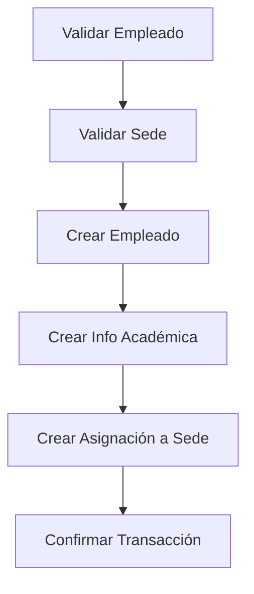
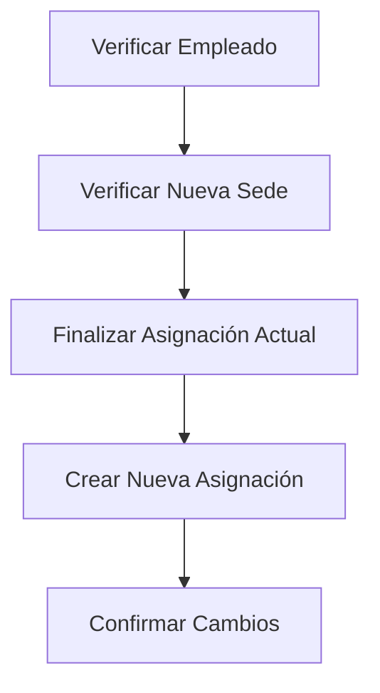

# Módulo de Empleado Normal - Flujo de Asignación a Una Sede

Este módulo proporciona funcionalidades para el **flujo estándar de empleados** que se asignan a una sola sede educativa, complementando el módulo especializado de rectores.

## 🏗️ Arquitectura

```
src/modulos/empleado/metodos/
├── empleado.service.ts      # Lógica de negocio para empleados normales
├── empleado.controller.ts   # Controlador HTTP con 8 endpoints
├── empleado.routes.ts       # Rutas para flujo normal
├── rector.service.ts        # Servicio especializado para rectores
├── rector.controller.ts     # Controlador para flujo de rectores
├── rector.routes.ts         # Rutas especializadas de rectores
├── index.ts                # Exportaciones del módulo
└── README.md               # Documentación principal
```

## 📋 Funcionalidades del Empleado Normal

### 1. Creación con Asignación Directa
**Endpoint:** `POST /api/v1/empleados/normal/crear-con-sede`

Crear empleado y asignarlo directamente a una sede específica en una sola operación transaccional.

**Características:**
- Creación atómica de empleado + asignación
- Validación de documento y email únicos
- Verificación de sede activa
- Información académica opcional
- Transacción completa con rollback automático

**Ejemplo de uso:**
```json
{
  "empleado": {
    "nombre": "Ana García Pérez",
    "documento": "87654321",
    "tipo_documento": "cedula",
    "cargo": "Docente",
    "email": "ana.garcia@sede.edu.co",
    "telefono": "555-0456"
  },
  "informacionAcademica": {
    "nivel_educativo": "Pregrado",
    "titulo": "Licenciatura en Matemáticas",
    "institucion_educativa": "Universidad Pedagógica"
  },
  "sedeId": "uuid-sede-123",
  "fechaAsignacion": "2025-10-03"
}
```

### 2. Asignación de Empleado Existente
**Endpoint:** `POST /api/v1/empleados/normal/:empleadoId/asignar-sede`

Asignar un empleado ya existente a una sede educativa.

**Características:**
- Verificación de empleado y sede activos
- Opción de reemplazar asignación actual
- Control de asignaciones duplicadas
- Historial automático de cambios

### 3. Transferencia Entre Sedes
**Endpoint:** `PUT /api/v1/empleados/normal/:empleadoId/transferir-sede`

Transferir empleado de una sede a otra manteniendo continuidad laboral.

**Características:**
- Finalización automática de asignación anterior
- Creación de nueva asignación
- Registro de motivo de transferencia
- Validación de sedes diferentes

### 4. Finalización de Asignación
**Endpoint:** `DELETE /api/v1/empleados/normal/:empleadoId/finalizar-asignacion`

Dar de baja al empleado de su sede actual (sin eliminar el empleado).

**Características:**
- Finalización de asignación activa
- Registro de fecha y motivo de baja
- Empleado queda disponible para nueva asignación

## 🔍 Consultas y Reportes

### 5. Empleados por Sede
**Endpoint:** `GET /api/v1/empleados/normal/sede/:sedeId/empleados`

Obtener todos los empleados asignados a una sede específica.

**Filtros disponibles:**
- `cargo`: Filtrar por cargo específico
- `estado`: Solo empleados activos o inactivos
- `solo_activos`: Solo asignaciones actualmente activas

### 6. Sedes Disponibles
**Endpoint:** `GET /api/v1/empleados/normal/sedes-disponibles`

Obtener sedes disponibles para asignar empleados.

**Filtros disponibles:**
- `zona`: Filtrar por zona (urbana/rural)
- `con_capacidad`: Incluir información de empleados actuales

### 7. Historial de Asignaciones
**Endpoint:** `GET /api/v1/empleados/normal/:empleadoId/historial-asignaciones`

Obtener historial completo de todas las asignaciones de un empleado.

**Información incluida:**
- Todas las asignaciones (activas y finalizadas)
- Datos de cada sede donde trabajó
- Períodos de trabajo en cada sede
- Estadísticas resumen

### 8. Validación de Asignación
**Endpoint:** `GET /api/v1/empleados/normal/validar-asignacion`

Validar si se puede asignar un empleado específico a una sede específica.

**Validaciones incluidas:**
- Existencia de empleado y sede
- Estados activos de ambos
- Conflictos de asignaciones existentes
- Recomendaciones de acción

## 🔐 Seguridad y Permisos

### Niveles de Acceso
- **Gestor**: Acceso completo (trabajo diario)
- **Admin**: Acceso completo con permisos adicionales
- **Super_admin**: Acceso completo sin restricciones

### Diferencia con Módulo Rector
- **Empleado Normal**: Gestores pueden usar (nivel operativo)
- **Rector**: Solo Admin/Super_admin (nivel estratégico)

## 🏢 Flujos de Negocio Comparados

### Flujo Normal vs Rector

| Aspecto | Empleado Normal | Rector Especializado |
|---------|----------------|---------------------|
| **Sedes** | Una sola sede | Múltiples sedes + institución |
| **Complejidad** | Simple | Compleja (transaccional) |
| **Permisos** | Gestor+ | Admin+ |
| **Uso** | Operativo diario | Estratégico |
| **Creación** | Empleado + 1 sede | Empleado + institución + N sedes |

### Flujo 1: Empleado Normal


### Flujo 2: Transferencia Simple


## 📊 Casos de Uso Reales

### Escenario 1: Docente Nuevo
```bash
# Crear docente y asignarlo a sede
curl -X POST http://localhost:3001/api/v1/empleados/normal/crear-con-sede \
  -H "Content-Type: application/json" \
  -H "Authorization: Bearer YOUR_TOKEN" \
  -d '{
    "empleado": {
      "nombre": "Carlos Mendoza",
      "documento": "23456789",
      "tipo_documento": "cedula",
      "cargo": "Docente"
    },
    "sedeId": "sede-primaria-123"
  }'
```

### Escenario 2: Transferir Empleado
```bash
# Transferir empleado a nueva sede
curl -X PUT http://localhost:3001/api/v1/empleados/normal/emp-123/transferir-sede \
  -H "Content-Type: application/json" \
  -H "Authorization: Bearer YOUR_TOKEN" \
  -d '{
    "nuevaSedeId": "sede-secundaria-456",
    "motivoTransferencia": "Necesidad de especialización"
  }'
```

### Escenario 3: Consultar Empleados de Sede
```bash
# Ver todos los docentes activos de una sede
curl -X GET "http://localhost:3001/api/v1/empleados/normal/sede/sede-123/empleados?cargo=Docente&solo_activos=true" \
  -H "Authorization: Bearer YOUR_TOKEN"
```

## 🛡️ Validaciones y Controles

### Validaciones de Integridad
- ✅ Documento único por empleado
- ✅ Email único por empleado  
- ✅ Sede debe existir y estar activa
- ✅ Empleado debe estar activo para asignación
- ✅ No duplicar asignaciones activas

### Controles de Negocio
- ✅ Un empleado = Una sede activa máximo
- ✅ Transferencias requieren sedes diferentes
- ✅ Finalización requiere asignación activa
- ✅ Validaciones antes de crear/asignar

### Manejo de Errores
```json
{
  "success": false,
  "message": "Ya existe un empleado con este documento",
  "error": "Validation failed",
  "data": null
}
```

## 🚀 Ejemplos Prácticos Completos

### 1. Flujo Completo: Nuevo Empleado
```javascript
// 1. Validar antes de crear
const validacion = await fetch('/api/v1/empleados/normal/validar-asignacion?empleadoId=nuevo&sedeId=sede-123');

// 2. Crear empleado con sede
const nuevoEmpleado = await fetch('/api/v1/empleados/normal/crear-con-sede', {
  method: 'POST',
  body: JSON.stringify({
    empleado: { /* datos */ },
    sedeId: 'sede-123'
  })
});

// 3. Verificar historial
const historial = await fetch(`/api/v1/empleados/normal/${empleadoId}/historial-asignaciones`);
```

### 2. Gestión de Transferencias
```javascript
// 1. Listar sedes disponibles
const sedes = await fetch('/api/v1/empleados/normal/sedes-disponibles?zona=urbana');

// 2. Transferir empleado
const transferencia = await fetch(`/api/v1/empleados/normal/${empleadoId}/transferir-sede`, {
  method: 'PUT',
  body: JSON.stringify({
    nuevaSedeId: 'sede-456',
    motivoTransferencia: 'Promoción'
  })
});
```

## 📈 Beneficios del Diseño Modular

### 1. **Separación Clara de Responsabilidades**
- **Normal**: Operaciones diarias simples (1 empleado = 1 sede)
- **Rector**: Operaciones complejas estratégicas (1 rector = N sedes + institución)

### 2. **Permisos Diferenciados**
- **Gestores**: Pueden manejar empleados normales
- **Admins**: Pueden manejar rectores y empleados

### 3. **Complejidad Apropiada**
- **Flujo simple** para casos comunes (95% de empleados)
- **Flujo complejo** para casos especiales (rectores)

### 4. **Mantenibilidad**
- Cada módulo es independiente
- Fácil testing y debugging
- Evolución independiente

## 🎯 Comparación: Cuándo Usar Cada Flujo

### Usar Flujo Normal (`/empleados/normal/*`)
- ✅ Docentes regulares
- ✅ Personal administrativo
- ✅ Empleados de apoyo
- ✅ Una sede por empleado
- ✅ Operaciones diarias simples

### Usar Flujo Rector (`/empleados/rector/*`)
- ✅ Rectores y coordinadores
- ✅ Múltiples sedes por persona
- ✅ Creación de instituciones
- ✅ Flujos complejos institucionales
- ✅ Decisiones estratégicas

---

**El módulo de empleado normal complementa perfectamente el módulo de rector, proporcionando una solución completa para todos los tipos de empleados del sistema educativo.**